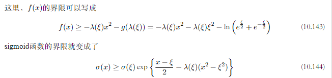
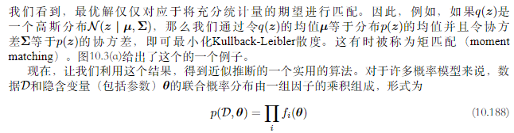

# 10 近似推断
[TOC]
在概率模型的应用中，一个中心任务是在给定观测（可见）数据变量$X$的条件下，计算潜在变量$Z$的后验概率分布$p(Z | X)$，以及计算关于这个概率分布的期望。
对于实际应用中的许多模型来说，计算后验概率分布或者计算关于这个后验概率分布的期望是不可行的。这可能是由于潜在空间的维度太高，以至于无法直接计算，或者由于后验概率分布的形式特别复杂，从而期望无法解析地计算。在连续变量的情形中，需要求解的积分可能没有解析解，而空间的维度和被积函数的复杂度可能使得数值积分变得不可行。对于离散变量，求边缘概率的过程涉及到对隐含变量的所有可能的配置进行求和。这个过程虽然原则上总是可以计算的，但是我们在实际应用中经常发现，隐含状态的数量可能有指数多个，从而精确的计算所需的代价过高。
根据近似方法依赖于随机近似还是确定近似，方法大体分为两大类。
## 10.1 变分推断
变分方法本质上没有任何近似的东西，但是它们通常会被用于寻找近似解。寻找近似解的过程可以这样完成：限制需要最优化算法搜索的函数的范围，例如只考虑二次函数，或者考虑由固定的基函数线性组合而成的函数，其中只有线性组合的系数可以发生变化。
假设我们有一个纯粹的贝叶斯模型，其中每个参数都有一个先验概率分布。这个模型也可以有潜在变量以及参数，我们会把所有潜在变量和参数组成的集合记作$Z$。类似地，我们会把所有观测变量的集合记作$X$.对于N个独立同分布的数据，其中$X=\{x_1,\dotsb,x_N\},Z=\{z_1,\dotsb,z_N\}$.概率模型确定了联合概率分布$p(X, Z)$，我们的目标是找到对后验概率分布$p(Z | X)$以及模型证据$p(X)$的近似。
可以将对数边缘概率分解，得到：
$$\begin{aligned}
\ln{p(x)}&=\mathcal L(q)+\mathbf {KL}(q||p) \\
\mathcal L(q)&=\int q(Z)\ln\Bigg\{\frac{p(X,Z)}{q(Z)}\Bigg\}{\rm d}Z\\
\mathbf{KL}(q||p)&=-\int q(Z)\ln\Bigg\{\frac{p(Z|X)}{q(Z)}\Bigg\}{\rm d}Z
\end{aligned}$$
与EM算法相比，参数向量$\theta$不再出现，被整合到$Z$当中。与之前一样，可以通过关于$q(Z)$优化下界$\mathcal L(q)$使之达到最大值，这等价于最小化$\mathbf{KL}$散度。若可任意选择$q(Z)$，则下界最大值出现在$\mathbf{KL}$散度等于0的时候，此时$q(Z)$等于后验概率分布$p(Z|X)$.所以对于$q(Z)$的受限类型，在该范围内找到使得$\mathbf{KL}$散度最小的概率分布。所以要限制$q(Z)$使得它易于处理，也要使得这个范围足够大，充分灵活，使得它可以对真实后验概率分布足够好的近似。
需要强调的是，施加限制条件的唯一目的是为了计算方便，并且在这个限制条件下，我们应该使用尽可能丰富的近似概率分布。特别地，对于高度灵活的概率分布来说，没有“过拟合”现象。使用灵活的近似仅仅使得我们更好地近似真实的后验概率分布。
### 10.1.1 分解概率分布
我们限制概率分布$q(Z)$的范围。假设我们将$Z$的元素划分成若干个互不相交的组，记作$Z_i,i=1,\dotsb,M$,我们假定q分布关于这些分组可以分解：
$$q(Z)=\prod_{i=1}^M q_i(Z_i)$$

我们希望对于$\mathcal L(q)$关于所有概率分布$q_i(Z_i)$进行自由形式的（变分）最优化，将$q_i(Z_i)$记作$q_i$：
$$\begin{aligned}
\mathcal L(q)&=\int \prod_{i}q_i\Bigg\{\ln{p(X,Z)-\sum_i \ln{q_i}}\Bigg\}{\rm d}Z \\
&=\int q_j \Bigg\{\int \ln{p(X,Z)}\prod_{i\neq j}q_i{\rm d}Z_i\Bigg\}{\rm d}Z_j-\int q_j\ln{q_j}{\rm d}Z_j+\text{const}\\
&=\int q_j \ln{\tilde p(X,Z_j)}{\rm d}Z_j-\int q_j\ln{q_j}{\rm d}Z_j+\text{const}\\
&=\mathbf{KL}(q_j||\tilde{p}(X,Z_j))+\text{const}
\end{aligned}$$
其中：
$$\begin{aligned}
 \ln{\tilde p(X,Z_j)}&=\mathbb E_{i\neq j}[\ln{p(X,Z)}]+\text{const}\\
 \mathbb E_{i\neq j}[\ln{p(X,Z)}]&=\int \ln{p(X,Z)}\prod_{i\neq j}q_j{\rm d}Z_i
\end{aligned}$$
可以得到最优解$q^*_j(Z_j)$的一般表达式为：
$$\ln{q^*_j(Z_j)}=\mathbb E_{i\neq j}[\ln{p(X,Z)}]+\text{const}$$

这个解表明，为了得到因子$q_j$ 的最优解的对数，我们只需考虑所有隐含变量和可见变量上的联合概率分布的对数，然后关于所有其他的因子$\{q_i\}$取期望即可，其中$i\neq j$.
其中可加性常数可以通过对概率分布 $q^*_j(Z_j)$进行归一化的方式得到：
$$q^*_j(Z_j)=\frac{\exp(\mathbb E_{i\neq j}[\ln{p(X,Z)}])}{\int \exp(\mathbb E_{i\neq j}[\ln{p(X,Z)}]){\rm d}Z_j}$$

这些方程并没有给出一个显式的解，因为最优化$q^*_j(Z_j)$的公式（10.9）的右侧表达式依赖于关于其他的因子$q_i(Z_i),i\neq j$计算的期望。于是，我们会用下面的方式寻找出一个相容的解：首先，恰当地初始化所有的因子$q_i(Z_i)$,然后在各个因子上进行循环，每一轮用一个修正后的估计来替换当前因子。
### 10.1.2 分解近似的性质
变分推断的方法基于的是真实后验概率分布的分解近似，当我们想要使用分解的高斯分布近似一个高斯分布的问题得时候，考虑两个相关变量$z=(z_1,z_2)$上的高斯分布$p(z)=\mathcal N(z|\mu,\Lambda^{-1})$,其中均值和精度：
$$\mu=\begin{bmatrix}
\mu_1\\
\mu_2
\end{bmatrix},\Lambda=\begin{bmatrix}
\Lambda_{11}&\Lambda_{12}\\
\Lambda_{21}&\Lambda_{22}
\end{bmatrix}$$
由于精度矩阵的对称性，可以得到：$\Lambda_{12}=\Lambda_{21}$,我们希望使用分解的高斯分布$q(z)=q_1(z_1)q_2(z_2)$,可以得到：
$$\begin{aligned}
\ln{q^*_1(z_1)}&=\mathbb E_{z_2}[\ln{p(z)}]+\text{const} \\
&=\mathbb E_{z_2}[-\frac{1}{2}(z_1-\mu_1)^2\Lambda_{11}-(z_1-\mu_1)\Lambda_{12}(z_2-\mu_2)]+\text{const}\\
&=-\frac{1}{2}z_1^2\Lambda_{11}+z_1\mu_1\Lambda_{11}-z_1\Lambda_{12}(\mathbb E[z_2]-\mu_2)+\text{const}
\end{aligned}$$

所以可以看到$q^*_1(z_1)$是一个高斯分布，这里我们并未假设$q(z_i)$是高斯分布，但是通过对所有可能分布的KL散度变分最优化推导得到了该结论。
使用配方法，可以得到：
$$q_q^*(z_1)=\mathcal{N}(z_1|m_1,\Lambda_{11}^{-1})$$

其中的：
$$m_1=\mu_1-\Lambda_{11}^{-1}\Lambda_{12}(\mathbb E[z_2]-\mu_2)$$

所以$q_2^*(z_2)$也是一个高斯分布：
$$q_2^*(z_2)=\mathcal N(z_2|m_2|\Lambda_{22}^{-1})$$

其中:
$$m_2=\mu_2-\Lambda_{22}^{-1}\Lambda_{21}(\mathbb E[z_1]-\mu_1)$$

所以这些解是相互耦合的，所以可将变分解看作是重估计方程，然后在变量之间循环，更新这些解，直到满足收敛准则为止。
该问题可以找到解析解，如果$\mathbb E[z_1]=\mu_1,\mathbb E[z_2]=\mu_2$，只要概率分布非奇异，则该解是唯一解，结果如10.2（a），均值被严重低估:分解变分近似对于后验概率分布的近似倾向于过于紧凑。

当我们最小化相反的KL散度$\mathbf {KL}(p||q)$,KL散度可以写作：
$$\mathbf{KL}(p||q)=-\int p(Z)\Bigg[\sum_{i=1}^M \ln{q_i(Z_i)}\Bigg]{\rm d}Z+\text{const}$$

使用拉格朗日乘数法，可以得到：
$$q^*_j(Z_j)=\int p(Z)\prod_{i\neq j}{\rm d}Z_i=p(Z_j)$$

在这种情况下，我们看到$q_j (Z_j )$的最优解等于对应的边缘概率分布$p(Z)$。注意，这是一个解析解，不需要迭代。该结果对均值的近似是正确的，但是它把相当多的概率质量放到了实际上具有很低的概率的变量空间区域中。
如果我们考虑用一个单峰分布近似多峰分布的问题，基于最小化KL(q ∥ p)的变分方法倾向于找到这些峰值中的一个。相反，如果我们最小化KL(p ∥ q)，那么得到的近似会在所有的均值上取平均。
这两种KL散度都是散度的$\alpha$家族的成员，定义为：
$$D_{\alpha}(p||q)=\frac{4}{1-\alpha^2}\Big(1-\int p(x)^{\frac{1+\alpha}{2}}q(x)^{\frac{1-\alpha}{2}}{\rm d}x\Big)$$

$\mathbf{KL}(p||q)$对应于$\alpha\rightarrow 1$,$\mathbf{KL}(q||p)$对应于$\alpha\rightarrow -1$.对于所有的$\alpha$，都有$D_{\alpha}(p||q)\geq 0$,当且仅当$p(x)=q(x)$时等号成立。
假设$p(x)$是固定的分布，关于某个概率分布$q(x)$的集合最小化$D_{\alpha}(p||q)$,则对于$\alpha\leq -1$时，散度是零强制的，即对于任意使得$p(x)=0$的x值，都有$q(x)=0$,通常q(x)会低估p(x)的支持，因此倾向于寻找具有最大质量的峰值。而对于$\alpha\geq 1$的情况，散度是零避免的，即对于任何使得$p(x)>0$的x值，都有$q(x)>0$.
### 10.1.4 模型比较
除了在隐含变量$Z$上进行推断之外，我们可能还希望对比一组候选模型。索引为$m$的模型的先验概率分布为$p(m)$。这样，我们的目标是近似后验概率分布$p(m | X)$，其中$X$是观测数据。
因为不同的模型可能具有不同的结构，并且隐含变量$Z$的维度实际上可能不同。因此我们不能简单地考虑考虑分解近似$q(Z)q(m)$，而是必须意识到$Z$的后验概率分布必须以$m$为条件，所以我们必须考虑$q(Z, m) = q(Z | m)q(m)$。我们已经可以验证下面的基于变分概率分布的分解方式:
$$\ln{p(X)}=\mathcal L-\sum_{m}\sum_Zq(Z|m)q(m)\ln{\frac{p(Z,m|X)}{q(Z|m)q(m)}}$$
其中$\mathcal L$是$\ln{p(X)}$的下界，形式为：
$$\mathcal L=\sum_m \sum_Zq(Z|m)q(m)\ln{\frac{p(Z,X,m)}{q(Z|m)q(m)}}$$

我们可以使用拉格朗日乘数法关于概率分布$q(m)$最大化$\mathcal L$，结果为:
$$q(m)\propto p(m)\exp\{\mathcal L_m\}$$

其中：
$$\mathcal L_m=\sum_Z q(Z|m)\ln{\frac{p(Z,X|m)}{q(Z|m)}}$$
我们关于$q(Z|m)$最大化$\mathcal L_m$，可以发现对于不同的m，解是耦合的。

## 10.4 指数族分布
对于许多模型来说，完整数据是服从指数族分布的，但是边缘概率分布不是服从指数族分布的。
我们可以将潜在变量与参数区分开。潜在变量Z是分散的，数量随数据集规模的增大而增大。参数$\theta$是分散的，它的数量是固定的，与数据集的规模无关。
现在假设观测变量和隐含变量的联合概率分布为指数族分布的成员，参数为自然参数$\eta$，即:
$$p(X,Z|\eta)=\prod_{n=1}^N h(x_n,z_n)g(\eta)\exp(\eta^T u(x_n,z_n))$$

对于$\eta$的共轭先验：
$$p(\eta|\nu_0,\chi_0)=f(\nu_0,\chi_0)g(\eta)^{\nu_0} \exp(\nu_0\eta^T\chi_0)$$

可以分解$q(Z,\eta)=q(Z)q(\eta)$,得到：
$$\begin{aligned}
\ln{q^*(Z)}&=\mathbb E_{\eta}[\ln{p(X,Z|\eta)}]+\text{const} \\
&=\sum_{n=1}^N \{\ln{h(x_n,z_n)+\mathbb E[\eta^T]u(x_n,z_n)}\}+\text{const}
\end{aligned}$$
因此我们看到它可以分解为一组相互独立的项的加和，每个n都对应于一项，因此$q^*(Z)$的解可以在n上进行分解，即$q^*(Z) = ∏_n q^*(z_n)$。这是诱导分解的一个例子。两侧取指数，我们有:
$$q^*(z_n)=h(x_n,z_n)g(\mathbb E[\eta])\exp\{\mathbb E[\eta^T]u(x_n,z_n)\}$$

对于参数上的变分分布，有：
$$\begin{aligned}
\ln{q^*(\eta)}&=\ln{p(\eta|\nu_0,\chi_0)}+\mathbb E_Z[\ln{p(X,Z|\eta)}]+\text{const} \\
&=\nu_0\ln{g(\eta)}+\nu_0\eta^T\chi_0+\sum_{n=1}^N \{\ln{g(\eta)}+\eta^T\mathbb E_{z_n}[u(x_n,z_N)]\}+\text{const}
\end{aligned}$$

两侧取指数，可以得到：
$$q^*(\eta)=f(\nu_N,\chi_N)g(\eta)^{\nu_N}\exp(\nu_N\eta^T \chi_N)$$

其中：
$$\begin{aligned}
\nu_N&=\nu_0+N \\
\nu_N\chi_N&=\nu_0\chi_0+\sum_{n=1}^N \mathbb E_{z_n}[u(x_n,z_n)]
\end{aligned}$$

$q^*(\eta)$与$q^*(z_n)$得解是相互耦合的，所以可以使用二阶段的迭代方法求解。在变分E步骤中，我们使用潜在变量上的当前后验概率分布$q(z_n)$计算充分统计量的期望$\mathbb E[u(x_n, z_n)]$，并且使用这个结果计算参数上的修正的后验概率分布$q(\eta)$。然后，在接下来的变分M步骤中，我们使用修正后的参数后验概率分布寻找自然参数的期望$\mathbb E[\eta^T ]$，它给出了潜在变量上的修正后的变分分布。
### 10.4.1 变分信息传递
对应于有向图的联合概率分布可以写成下面的分解形式:
$$p(x)=\prod_{i} p(x_i|\text{pa}_i)$$

其中$x_i$表示与节点$i$关联的变量，$\text{pa}_i$表示与节点i相对应的父节点集合。这里$x_i$可以是一个潜在变量，也可以是属于观测变量集合。现在对于变分近似，假定概率分布$q(z)$可以对$x_i$分解，即：
$$q(x)=\prod_{i}q_i(x_i)$$

于是根据前面的结果可以得到：
$$\ln{q^*_j(x_j)}=\mathbb E_{i\neq j}\Bigg[\sum_i \ln{p(x_i|\text{pa}_i)}\Bigg]+\text{const}$$

唯一依赖于$x_j$的项是由$p(x_j|\text{pa}_j)$给出的$x_j$的条件概率分布以及任何在条件集合中有$x_j$的条件概率分布。所以这些条件概率分布对应于节点j的子节点，所以也依赖于子节点的同父节点。所以$q_j^*(x_j)$所以来的所有节点组成的集合对应于节点$x_i$的马尔科夫毯。因此，在变分后验概率分布中的更新因子表示图上的一个局部计算。
如果我们现在确定模型的形式，其中所有的条件概率分布都有一个共轭-指数族的结构，那么变分推断的过程可以被转化为局部信息传递算法。特别地，对于一个特定的结点来说，一旦它接收到了来自所有的父结点和所有的子结点的信息，那么与这个结点相关联的概率分布就可以被更新。这反过来需要子结点从它们的同父结点已经接收完毕信息。下界的计算也可以得到简化，因为许多必要的值已经作为信息传递框架的一部分计算完毕。分布的信息传递形式有很好的缩放性质，对于大的网络很合适。
## 10.5 局部变分方法
另一种“局部”的方法涉及到寻找模型中的单独的变量或者变量组上定义的函数的界限。例如，我们可能寻找条件概率分布$p(y | x)$的界限，这个条件概率本身仅仅是一个由有向图模型描述的更大的概率模型中的一个因子。引入界限的目的显然是简化最终得到的概率分布。这个局部近似可以应用于多个变量，直到得到一个可以处理的近似。对数函数的凸函数性质在求解全局变分方法的下界时起到关键作用，我们将凸函数定义为每条弦都在函数上方的函数，同样对于凸函数，只需要将最大化转为最小化，下界转为上界即可。
比如对于函数$f(x)=\exp(-x)$是x的一个凸函数，我们使用x的线性函数逼近：如果这个线性函数对应于一条切线，则它是$f(x)$的下界。我们将得到具体的x处$y(x)$的切线，例如在$x=\xi$处，使用一阶泰勒展开：
$$y(x)=f(\xi)+f'(\xi)(x-\xi)$$

所以$y(x)\leq f(x)$等号只在$x=\xi$处成立。所以得到：
$$y(x)=\exp(-\xi)-\exp(-\xi)(x-\xi)$$

这是一个以$\xi$为参数的线性函数，我们定义$\eta=-\exp(-\xi)$,所以：
$$y(x,\eta)=\eta x-\eta+\eta\ln{(-\eta)}$$

不同的$\eta$对应于不同的切线，所有的切线都是函数的下界，所以$f(x)\geq y(x,\eta)$所以得到：
$$f(x)=\max_{\eta}\{\eta x-\eta+\eta\ln{(-\eta)}\}$$

我们可以使用凸对偶（convex duality）的框架更加一般地形式化描述这种方法：

$$\begin{aligned}
g(\eta)&=-\min_x\{f(x)-\eta x\} \\
&=\max_x \{\eta x-f(x)\}
\end{aligned}$$

同样地，可以得到：
$$\begin{aligned}
f(x)=\max_{\eta}\{\eta x-g(\eta)\} \\
\end{aligned}$$

所以对于$f(x)=\exp(-x)$,可以得到$g(\eta)=\eta-\eta\ln{-\eta}$.
对于凹函数，可以得到上界：
$$\begin{aligned}
f(x)&=\min_{\eta}\{\eta x-g(\eta)\} \\
g(\eta)&=\min_{x}\{\eta x-f(x)\}
\end{aligned}$$
如果感兴趣的函数不是凸函数（或者凹函数），那么我们不能直接应用这种方法得到上述界限。然而，我们可以首先寻找函数或者参数的一个可逆变换，这个变换将函数或者参数变换为一个凸函数的形式。然后，我们计算共轭函数，之后变换回原始的变量。
对于logistic sigmod函数：
$$\sigma(x)=\frac{1}{1+e^{-x}}$$

我们将其取对数后就是一个凹函数，其共轭函数为：
$$g(\eta)=-\eta\ln{(-\eta)}-(1-\eta)\ln{(1-\eta)}$$

他是一个二元变量的熵，变量取值为1的概率为$\eta$，可以得到对数sigmod函数的上界
$$\ln{\sigma(x)}\leq \eta x-g(\eta)$$

然后取指数，可以得到logistic sigmod函数的一个上界：
$$\sigma(x)\leq \exp(\eta x-g(\eta))$$

我们也可以得到sigmoid函数的下界，下界的函数形式是高斯形式。对输入变量和函数本身都进行变换。首先，我们取logistic函数的对数，然后将其分解，即
$$\begin{aligned}
\ln{\sigma(x)}&=-\ln{(1-e^{-x})} \\
&=-\ln{e^{-\frac{x}{2}}(e^{(\frac{x}{2})+e^{-\frac{x}{2}}})}\\
&=\frac{x}{2}-\ln{(e^{(\frac{x}{2})+e^{-\frac{x}{2}}})}
\end{aligned}$$

## 10.7 期望传播

---

* 初始化所有的近似因子$\tilde{f}_i(\theta)$
* 通过设置$q(\theta)\propto \prod_i \tilde{f}_i*\theta$初始化后验近似
* 直到收敛：
  * 选择一个因子$\tilde{f}_i(\theta)$进行优化
  * 通过$q^{\setminus j}(\theta)=\frac{q(\theta)}{\tilde{f}_j(\theta)}$ 从后验概率中移除$\tilde{f}_j(\theta)$
  * 算新的后验概率分布，方法为：令$q^{\text{new}}(\theta)$的充分统计量（矩）等于$q^{\setminus j}(\theta)f_j(\theta)$的充分统计量（矩），包括计算归一化系数$$Z_j=\int q^{\setminus j}(\theta)f_j(\theta){\rm d}theta$$
  * 计算和存储新的因子$$\tilde{f}_j(\theta)=Z_j\frac{q^{\text{new}}(\theta)}{q^{\setminus j}(\theta)}$$
* 计算模型证据的近似$$p(D)\simeq \int \prod_i \tilde f_i(\theta){\rm d} \theta$$

----

