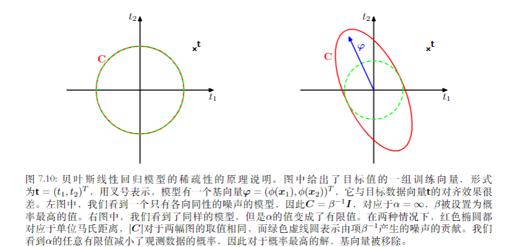
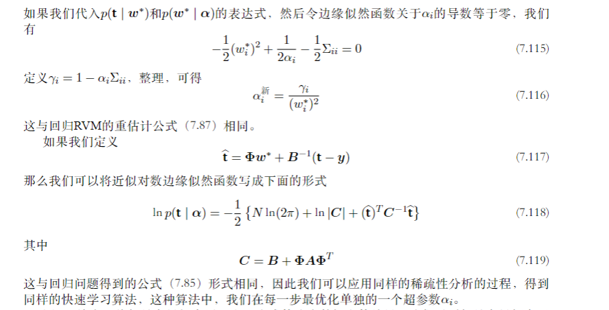
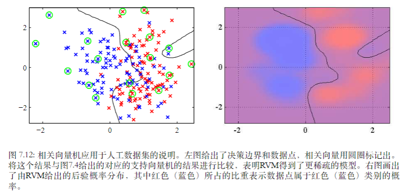

# 7 稀疏核机
[TOC]
基于非线性核的学习算法最大的局限性是函数$k(x_n,x_m)$必须要对所有可能的训练点对$x_n,x_m$进行求值，这在训练阶段的计算上是不可行的，并且对于新数据点的预测也会花费过多的时间。所以我们需要具有稀疏解的基于核的算法。所以对于新数据点的预测只依赖于训练数据点的一个子集上计算的核函数。
支持向量机可以解决分类、回归和异常点检测问题，其重要的性质是模型参数的确定对应于一个凸最优化问题，因此许多局部解就是全局最优解。
SVM是一个决策机器，所以不提供后验概率，另一种稀疏核方法，称为相关向量机RVM，提供了后验概率分布，通常可产生比SVM更稀疏的解。
## 7.1 最大边缘分类器
对于线性模型的二分类问题，形式为：
$$y(x)=w^T\phi(x)+b$$
其中$\phi(x)$表示的是一个固定的特征空间变换。我们使用核函数表达的对偶形式，这比面儿在特征空间中显式进行计算。训练数据由$x_1,\dotsb,x_N$组成，对应的目标值$t_1,\dotsb,t_N$其中$t_n\in \{-1,1\}$,新的数据点x根据$y(x)$的符号进行分类
我们假设训练数据集在特征空间中是线性可分的，即根据定义，存在至少一个参数$w$和$b$的选择方式，使得对于$t_n = +1$的点，函数$y(x)$都满足$y(x_n) > 0$，对于$t_n = 1$的点，都有$y(x_n) < 0$，从而对于所有训练数据点，都有$t_ny(x_n) > 0$。
存在许多可以将类别精确分开的解，对于感知机算法，可以保证在有限步骤内找到一个解，但是该解依赖于参数$w$和$b$的初始值选择，还依赖于数据点的出现顺序，我们试图找到泛化错误最小的那个解。所以我们引入margin的概念，即决策边界与任意样本之间的最小距离。
在支持向量机中，决策边界被选为使margin最大化的那个决策边界。
对于一个简单的线性可分数据集，在贝叶斯方法中，关于参数的先验概率分布进行积分或者求和，可以产生一个决策边界，该边界在分开数据点的区域中间。
点x到由$y(x)=0$定义的超平面的垂直距离为$\frac{|y(x)|}{||w||}$,我们感兴趣的是对于能够正确分类的数据点的解，即对于所有的$n$都有$t_ny(x_n)>0$,因此点$x_n$距离决策面的近距离：
$$\frac{t_n y(x_n)}{||w||}=\frac{t_n (w^T\phi(x_n)+b)}{||w||}$$
margin由数据集里垂直距离最近的点$x_n$给出，我们希望最优化参数$w$和$b$,使得该距离最大化，因此，最大margin解可以由下式得到：
$$\argmax_{w,b}\Bigg \{\frac{1}{||w||}\min_n\big[t_n(w^t\phi(x_n)+b)\big]\Bigg \}$$
我们将因子$\frac{1}{||w||}$提到了对n的最优化之外，因为w与n无关。直接求解这个最优化问题相当复杂，因此我们要把它转化为一个更容易求解的等价问题。我们如果重新标度$w\rightarrow \kappa w,b\rightarrow \kappa b$,则对于任意点$x_n$距离决策面的距离$\frac{t_ny(x_n)}{||w||}$不会发生改变，所以，对于决策面最近的点，令：
$$t_n(w^t\phi(x_n)+b)=1$$
在这种情况下所有的数据点都满足：
$$t_n(w^t\phi(x_n)+b)\geq 1,\ \ n=1,\dotsb, N$$

这 被 称 为 决 策 超 平 面 的 标 准 表 示。 对 于 使 上 式 取 得 等 号 的 数 据 点， 我 们 说 限 制 被 激 活.
根据定义，总会存在至少一个激活限制，因为总会有一个距离最近的点，并且一旦边缘被最大化，会有至少两个激活的限制。这样，最优化问题就简化为了最大化$1/∥w∥$，这等价于最小化$∥w∥^2$，因此我们要在限制条件$t_n(w^t\phi(x_n)+b)\geq 1,\ \ n=1,\dotsb, N$下，求解最优化问题:
$$\argmin_{w,b}\frac{1}{2}||w||^2$$

我们需要在一系列线性不等式的限制条件下最小化二次函数，对于b我们可以隐式根据限制条件确定，因为限制条件要求$||w||$的改变需要通过$b$的改变进行补偿，为了解决这个限制的最优化问题，我们引入拉格朗日乘数$a_n\geq 0$,$t_n(w^t\phi(x_n)+b)\geq 1,\ \ n=1,\dotsb, N$中每一个限制条件都对应于一个乘数$a_n$,从而得到拉格朗日函数：
$$L(w,b,a)=\frac{1}{2}||w||^2-\sum_{n=1}^Na_n\{t_n(w^T\phi(x)+b)-1\}$$
注意拉格朗日乘数项前面的负号，因为我们要关于w和b最小化，关于a最大化,令L(w, b, a)关于w和b的导数等于零，我们得到了下面两个条件:
$$w=\sum_{n=1}^N a_nt_n\phi(x_n)\\ 0=\sum_{n=1}^N a_nt_n$$

使用上面的条件从L函数中消去$w$和$b$，可以得到最大化margin问题的对偶问题，我们要对它对a进行最大化：
$$\tilde{L}(a)=\sum_{n=1}^Na_n-\frac{1}{2}\sum_{n=1}^N \sum_{m=1}^N a_na_mt_nt_mk(x_n,x_m)$$
限制条件为：
$$\begin{aligned}
&a_n\geq 0,\ \ n=1,\dotsb,N \\
&0=\sum_{n=1}^N a_nt_n
\end{aligned}$$
这里的核函数被定义为：$k(x,x')=\phi(x)^T\phi(x')$,我们需要在不等式限制条件下最优化a的二次函数。
对偶问题使得模型能够用核函数重新表示，因此最大margin分类器可以被高效地应用于维数超过数据点个数的特征空间，包括无穷维特征空间。核公式也让核函数$k(x, x')$正定这一限制条件存在的原因变得更显然，因为这确保了拉格朗日函数 $\tilde L(a)$有上界，从而使得最优化问题有良好的定义。
所以预测函数:
$$y(x)=\sum_{n=1}^N a_nt_nk(x,x_n)+b$$

这种形式的限制的最优化问题满足Karush-Kuhn-Tucker（KKT）条件。在这个问题中，下面三个性质要成立:
$$\begin{aligned}
&a_n\geq 0 \\
&t_ny(x_n)-1\geq 0\\
&a_n(t_ny(x_n)-1)=0
\end{aligned}$$

因此对于每个数据点，要么$a_n = 0$，要么$t_ny(x_n) = 1$,对于任何$a_n=0$的数据点对于新数据点的预测都没有作用，剩下的数据点也被称为支持向量，由于它们满足$t_ny(x_n)=1$,所以他们都在特征空间中位于最大margin超平面的点，一旦模型被训练完毕，相当多的数据点都可以被丢弃，只有支持向量被保留。
然后我们可以根据得到的$a$,由于支持向量满足 $t_ny(x_n)=1$，可得到b的值：
$$t_n\Bigg (\sum_{m\in S}a_mt_mk(x_n,x_m)+b \Bigg)=1$$

虽然我们可以使用任意选择的支持向量$x_n$解这个关于b的方程，但是我们可以通过下面的方式得到一个在数值计算上更加稳定的解。
$$b=\frac{1}{N_{S}}\sum_{n\in S}\Bigg(t_n-\sum_{m\in S}a_mt_mk(x_n,x_m)\Bigg)$$
我们可以将最大化margin分类器用带有简单二次正则化项的最小化误差函数表示，形式为：
$$\sum_{n=1}^N E_{\infty}(y(x_n)t_n-1)+\lambda ||w||^2$$

其中$E_{\infty}(z)$是一个函数，当z大于等于零时，函数值为零，否则为无穷，确保限制条件的成立。只要正则化系数$\lambda>0$,则其精确值就没有作用。
从几何角度也可以说明SVM中稀疏性的来源。最大边缘超平面由支持向量的位置定义，其他数据点可以自由移动（只要仍然在边缘区域之外）而不改变决策边界，因此解与这些数据点无关。
### 7.1.1 重叠类分布
在实际中，类条件分布可能重叠，这种情况下对训练数据的精确划分会导致较差的泛化能力。
因 此 我 们 需 要 一 种 方 式 修 改 支 持 向 量 机， 允 许 一 些 训 练 数 据 点 被 误 分 类。
我们现在修改SVM，使得数据点允许在边缘边界的“错误侧”，但是增加一个惩罚项，这个惩罚项随着与决策边界的距离的增大而增大。
我们引入松弛变量$\xi_n\geq 0$,每一个训练数据都有一个松弛变量。对于在正确的边缘边界内的点或者在边界上的点，$\xi_n=0$,对于其他的点，我们令$\xi_n=|t_n-y(x_n)|$.所以对于决策边界$y(x_n)=0$上的点,$\xi_n=1$,所以限制条件被替换为：
$$t_ny(x_n)\geq 1-\xi_n$$

其中的松弛变量被限制为$\xi_n\geq 0$.$\xi_n= 0$的点被正确分类，要么在边缘上，要么在边缘的正确一侧，这种方法可被描述为放宽边缘的硬限制，得到软边缘，并允许一些训练数据点被错误分类，虽然松弛变量允
许类分布的重叠，但是这个框架对于异常点很敏感，因为误分类的惩罚随着$\xi$线性增加.
现在我们的目标是最大化边缘，同时以一种比较柔和的方式惩罚位于边缘边界错误一侧的点。于是，我们最小化:
$$C\sum_{n=1}^N \xi_n+\frac{1}{2}||w||^2$$

其中参数C>0控 制 了 松 弛 变 量 惩 罚 与 边 缘 之 间 的 折 中.由 于 任 何 被 误 分 类 的 数 据 点 都有$\xi_n>1$，因此$\sum_{n}\xi_n$是误分类数据点数量的上界。于是，参数C类似于（作用相反的）正则化系数，因为它控制了最小化训练误差与模型复杂度之间的折中。在$C \rightarrow \infty$的期限情况下，我们就回到了之前讨论过的用于线性可分数据的支持向量机。
在限制条件下最小化$C\sum_{n=1}^N \xi_n+\frac{1}{2}||w||^2$，对应的拉格朗日函数为：
$$L(w,b,\xi,a,\mu)=\frac{1}{2}||w||^2+C\sum_{n=1}^N \xi_n-\sum_{n=1}^N a_n\{t_ny(x_n)-1+\xi_n\}-\sum_{n=1}^N \mu_n\xi_n$$

其中$a_n\geq 0,\mu_n\geq 0$是拉格朗日乘数，对应的KKT条件为：
$$\begin{aligned}
&a_n\geq 0 \\
&t_ny(x_n)-1+\xi_n\geq 0\\
&a_n(t_ny(x_n)-1+\xi_n)=0\\
&\mu_n\geq 0\\
&\xi_n\geq 0\\
&\mu_n\xi_n= 0
\end{aligned}$$

我们对$w,b,\xi_n$进行最优化，得到：
$$\frac{\partial L}{\partial w}=0\rightarrow w=\sum_{n=1}^N a_nt_n \phi(x_n)\\ \frac{\partial L}{\partial b}=0\rightarrow \sum_{n=1}^N a_nt_n=0\\ \frac{\partial L}{\partial \xi_n}=0\rightarrow a_n=C-\mu_n$$

得到：
$$\tilde{L}(a)=\sum_{n=1}^N a_n-\frac{1}{2}\sum_{n=1}^N \sum_{m=1}^N a_na_mt_nt_mk(x_n,x_m)$$

同时要满足：
$$0\leq a_n\leq C\\ \sum_{n=1}^N a_nt_n=0$$

我们现在可以表示最终的解。与之前一样，对于数据点的一个子集，有$a_n = 0$，在这种情况下这些数据点对于预测模型没有贡献。剩余的数据点组成了支持向量。这些数据点满足$a_n > 0$，因此根据公式，它们必须满足:
$$t_ny(x_n)=1-\xi_n$$

所以为了确定参数b，仍然可以根据支持向量数据点求b，求平均得到：
$$b=\frac{1}{N_M}\sum_{n\in M}\Bigg(t_n-\sum_{m\in S}a_mt_mk(x_n,x_m)\Bigg)$$
另一种等价的形式叫做$v-SVM$,涉及到最小化：
$$\tilde L(a)=-\frac{1}{2}\sum_{n=1}^N \sum_{m=1}^N a_na_mt_nt_mk(x_n,x_m)$$
限制条件为：
$$\begin{aligned}
0\leq a_n\leq \frac{1}{N} \\
\sum_{n=1}^N a_nt_n=0\\
\sum_{n=1}^Na_n\geq \nu
\end{aligned}$$
这种方法的优点是，参数$\nu$代替了参数C，它既可以被看做边缘错误（margin error）（$\xi_n > 0$的点，因此就是位于边缘边界错误一侧的数据点，它可能被误分类也可能没被误分类）的上界，也可以被看做支持向量比例的下界。
虽然对新输入的预测只通过支持向量完成，但是训练阶段（即确定参数a和b的阶段）使用了整个数据集，因此找到一个解决二次规划问题的高效算法很重要。
使用传统的方法直接求解二次规划问题通常是不可行的，因为需要的计算量和存储空间都相当大，因此我们需要寻找更实际的方法,如分块方法和分解方法，但是仍然代价很高，所以使用SMO，这种方法考虑了分块方法的极限情况，每次只考虑两个拉格朗日乘数。这种情况下，子问题可以解析地求解，因此避免了数值二次规划。选择每一步骤中需要考虑的拉格朗日乘数对时，使用了启发式的方法。在实际应用中，SMO与训练数据点数量的关系位于线性与二次之间，取决于具体的应用。
持向量机或许在一定程度上避免了维度灾难的问题。然而，事实并非如此，因为限制了特征空间维度的特征的值之间存在限制。
因此，若核函数表示六维特征空间中的一个内积，原始二维空间x中的任意点集都会被限制到六维特征空间中的二维非线性流形中。
支持向量机不提供概率输出，而是对新的输入进行分类决策。如果我们希望把SVM用作较大的概率系统中的一个模块，那么我们需要对于新的输入x的类别标签t的概率预测，使用logistic sigmoid函数拟合训练过的支持向量机的输出的方法。具体来说，需要求解的条件概率被假设具有下面的形式：
$$p(t=1|x)=\sigma(Ay(x)+B)$$

用于拟合sigmoid函数的数据需要独立于训练原始SVM的数据，为了避免严重的过拟合现象。这种两个阶段的方法等价于假设支持向量机的输出y(x)表示属于类别t = 1的x的对数概率。由于SVM的训练过程并没有体现这种倾向，因此SVM给出的对后验概率的近似结果比较差
### 7.1.2 与logistic回归的关系
可以看到，对于边缘边界正确一侧的数据点，即满足$t_ny_n\geq 1$的数据点，有$\xi_n=0$,对于剩下的数据点，$\xi_n=1-t_ny_n$所以目标函数:
$$\sum_{n=1}^NE_{SV}(y_nt_n)+\lambda ||w||^2$$

铰链函数为：$$E_{SV}(y_nt_n)=[1-y_nt_n]_+$$
而考虑logistic回归模型时，我们对目标变量t进行操作，可以看到，$p(t=1|y)=\sigma(y)，p(t|y)=\sigma(yt)$
所以使用对数似然取负对数的方式构造误差函数，带正则化的误差函数的形式为：
$$\sum_{n=1}^N E_{LR}(y_nt_n)+\lambda ||w||^2$$

其中：
$$E_{LR}(y_nt_n)=\ln{1+\exp(-yt)}$$
为了与其他的误差函数进行比较，我们可以除以ln(2)使得误差函数通过点(0, 1)。重新标度的误差函数形式与支持向量机的误差函数类似。关键的区别在于$E_{SV} (y_t)$的平台区域产生了稀疏解.
### 7.1.3 多类SVM
一种常用方法是构建K个独立的SVM，第k个模型在训练时，将来自$C_k$类别的数据作为正类，剩余的为负例，被称为“1对剩余”（one-versus-the-rest）方法。
使用独立的分类器进行决策会产
生不相容的结果，其中一个输入会同时被分配到多个类别中，可以使用$$y(x)=\max_k y_k(x)$$
产生一个问题：不同的分类器是在不同的任务上进行训练的，无法保证不同分类器产生的实数值$y_k(x)$具有恰当的标度。另一个问题是训练集合不平.
另一种方法是在所有可能的类别对之间训练 $\frac{K(K-1)}{2}$ 个不同的二分类SVM，然后将测试数据点分到具有最高“投票数”的类别中去。这种方法有时被称为“1对1”（one-versus-one）。
也存在单一类别（single-class）支持向量机，它解决与概率密度估计相关的无监督学习问题。但是，这种方法不是用来对数据的概率密度建模，而是想找到一个光滑的边界将高密度的区域包围起来。边界用来表示概率密度的等分点，即从概率密度分布中抽取的一个数据点落在某个区域的概率由一个0到1之间的固定的数给出，这个数事先指定好。与进行整体的密度估计相比，这个问题更加受限，但是对于某些具体的应用已经足够了。
### 7.1.4 回归问题的SVM
简单的线性回归模型中，我们最小化一个正则化的误差函数:
$$\frac{1}{2}\sum_{n=1}^N \{y_n-t_n\}^2+\frac{\lambda}{2}||w||^2
$$
为了得到稀疏解，二次误差函数被替换为一个ε-不敏感误差函数,如果预测y(x)和目标t之间的差的绝对值小于ε，那么这个误差函数给出的误差等于零，其中ε > 0。ε-不敏感误差函数的一个简单的例子是:
$$E_\epsilon(y(x)-t)=\begin{cases}
0,&如果|y(x)-t|<\epsilon \\
|y(x)-t|-\epsilon &其他情况
\end{cases}$$
于是我们最小化正则化的误差函数，形式为
$$C\sum_{n=1}^N E_{\epsilon}(y(x)-t_n)+\frac{1}{2}||w||^2$$
然后引入两个松弛变量$\xi_n\geq 0,\hat \xi_n\geq 0$,分别对应于$t_n>y(x_n)+\epsilon,t_n<y(x_n)-\epsilon$的数据点。
使用拉格朗日函数：
$$L=C\sum_{n=1}^N (\xi_n+\hat \xi_n)+\frac{1}{2}||w||^2-\sum_{n=1}^N(\mu_n\xi_n+\hat \mu_n \hat \xi_n)\\-\sum_{n=1}^N a_n(\epsilon+\xi_n+y_n-t_n)-\sum_{n=1}^N \hat a_n(\epsilon+\hat \xi_n+y_n-t_n)$$
然后使对应变量的导数为0，然后得到：
$$\tilde{L}(a,\hat a)=-\frac{1}{2}\sum_{n=1}^N \sum_{m=1}^N (a_n-\hat a_n)(a_m-\hat a_m)k(x_n,x_m)-\epsilon\sum_{n=1}^N (a_n+\hat a_n)+\sum_{n=1}^N(a_n-\hat a_n)t_n$$
得到盒限制：
$$\begin{aligned}
0\geq a_n \geq C \\
0\geq \hat a_n\geq C
\end{aligned}$$
对于新的输入变量，可使用下式预测：
$$y(x)=\sum_{n=1}^N(a_n-\hat a_n)k(x,x_n)+b$$

对应的KKT条件为：
$$\begin{aligned}
a_n(\epsilon+\xi_n+y_n-t_n)=0 \\
\hat a_n(\epsilon+\hat \xi_n-y_n+t_n)=0\\
(C-a_n)\xi_n=0\\
(C-\hat a_n)\hat \xi_n=0
\end{aligned}$$
所以在$\epsilon$管道内的数据点，$a_n=\hat a_n=0$,否则$a_n,\hat a_n$有且仅有一个不等于零，所以我们得到稀疏解，即涉及到支持向量的项。
参数b可以通过使$0<a_n<C$的数据点求解得到：
$$\begin{aligned}
b&=t_n-\epsilon-w^T\phi(x_n)\\&=t_n-\epsilon-\sum_{m=1}^N (a_n-\hat a_m)k(x_n,x_m) 
\end{aligned}$$

另一种用于回归的SVM的形式。这种形式的SVM中，控制复杂度的参数有一个更加直观的意义,我们不固定不敏感区域的宽度，而是固定位于管道外部数据点的比例$\nu$,这涉及到最大化：
$$\tilde L(a,\hat a)=-\frac{1}{2}\sum_{n=1}^N\sum_{m=1}^N (a_n-\hat a_n)(a_m-\hat a_m)k(x_n,x_m)+\sum_{n=1}^N (a_n-\hat a_n)t_n$$

限制条件为：
$$\begin{aligned}
&0\leq a_n\leq \frac{C}{N} \\
&0\leq \hat a_n\leq \frac{C}{N}\\
&\sum_{n=1}^N (a_n-\hat a_n)=0\\
&\sum_{n=1}^N (a_n+\hat a_n)\leq \nu C
\end{aligned}$$
### 7.1.5 计算学习理论
支持向量机大量地使用一个被称为计算学习理论（computational learning theory）的理论框架进行分析。PAC学习框架的目标是理解为两个给出较好的泛化能力，需要多大的数据集。这个框架也给出了学习的计算代价的界限，虽然我们不会在这里讨论。
假设我们从联合概率分布$p(x, t)$中抽取一个大小为N 的数据集D，其中x是输入变量，t表示类别标签。我们把注意力集中于“无噪声”的情况，即类别标签由某个（未知的）判别函数$t = g(x)$确定。在PAC学习中，空间$\mathcal F$是一个以训练集D为基础的函数组成的空间，我们从空间$\mathcal F$中抽取一个函数$f (x, D)$，如果它的期望错误率小于某个预先设定的阈值ε，即:
$$\mathbb E_{x,t}[I(f(x;D)\neq t)]<\epsilon$$
那么我们就说函数$f (x, D)$具有较好的泛化能力。其中I(.)是示性函数，期望是关于概率分布$p(x, t)$的期望。PAC框架要求，对于从概率分布$p(x, t)$中随机抽取的数据集D，公式成立的概率要大于$1-\delta$.“概 率 近 似 正 确”来 自 于 下 面 的 要 求： 以 一 个 较 高 的 概率（大于$1-\delta$），使得错误率较小（小于ε）。对于一个给定的模型空间$\mathcal F$，以及给定的参数ε和$\delta$，PAC学习的目标是提供满足这个准则所需的最小数据集规模N 的界限。
由于缺少关于分布形式的任何假设，因此PAC边界非常保守，换句话说，它们严重高估了得到给定的泛化性能所需的数据集的规模。因此，PAC界限几乎没有任何实际用处。
## 7.2 相关向量机
相关向量机（relevance vector machine）或者RVM是一个用于回归问题和分类问题的贝叶斯稀疏核方法，它具有许多SVM的特征，同时避免了SVM的主要的局限性。此外，它通常会产生更加稀疏的模型，从而使得在测试集上的速度更快，同时保留了可比的泛化误差。
### 7.2.1 用于回归的RVM
给定一个输入向量x的情况下，实值目标变量t的条件概率分布，形式为:
$$p(t|x,w,\beta)=\mathcal N(t|y(x),\beta^{-1})$$

其中$\beta=\sigma^{-2}$是噪声精度，均值由线性模型给出：
$$y(x)=\sum_{i=1}^M w_i\phi_i(x)=w^T\phi(x)$$

RVM中基函数由核给出，训练集的每个点关联着一个核：
$$y(x)=\sum_{n=1}^N w_nk(x,x_n)+b$$
参数的数量为：$M=N+1$,与SVM的情形相反，没有正定核的限制，基函数也没有被训练数据点的数量或位置所限制。
假设我们有输入向量x的N 次观测，我们将这些观测聚集在一起，记作数据矩阵X,则似然函数为：
$$p(\mathbf t|X,w,\beta)=\prod_{n=1}^N p(t_n|x_n,w,\beta)$$

然后引入参数向量w上的先验分布，RVM关键在于为每一个全参数都引入单独的超参数$\alpha_i$,而不是共享的超参数，因此权值先验形式为：
$$p(w|\alpha)=\prod_{i=1}^M \mathcal N(w_i|0,\alpha_i^{-1})$$

所以可以看到，当对这些超参数最大化模型证据的时候，大部分会趋于无穷，所以对应的权参数的后验概率集中分布在0附近，所以这些参数关联的基函数对于模型预测不起作用，会被高效的剪枝，生成一个稀疏的模型。
所以后验概率分布：
$$p(w|\mathbf t,X,\alpha,\beta)=\mathcal N(w|m,\Sigma)\\ m=\beta\Sigma\Phi^T\mathbf t\\\Sigma=(A+\beta\Phi^T\Phi)^{-1}$$
$A = diag( \alpha_i)$
对于$\alpha,\beta$可以使用证据近似来确定，最大化边缘似然函数，边缘似然函数可以对权向量进行积分得到：
$$p(\mathbf t|X,\alpha,\beta)=\int p(\mathbf t|X,\alpha,w,\beta)p(w|\alpha){\rm d}w$$

这表示两个高斯分布的卷积，所以可以求得对数边缘似然函数：
$$\ln{p(\mathbf t|X,\alpha,\beta)}=\ln{\mathcal N(\mathbf t|0,C)}=-\frac{1}{2}\{N\ln{2\pi}+\ln{|C|}+\mathbf t^T C^{-1}\mathbf t\}\\ C=\beta^{-1}I+\Phi A^{-1}\Phi^T$$

我们现在的目标是关于超参数$\alpha$ 和$\beta$ 最大化$\ln{p(\mathbf t|X,\alpha,\beta)}$,可以用两种方法得到，首先，可以令要求解的边缘似然导数等于0，得到重估计方程：
$$\begin{aligned}
\alpha_i^{new}&=\frac{\gamma_i}{m_i^2} \\
(\beta^{new})^{-1}=\frac{||\mathbf t-\Phi m||^2}{N-\sum_i \gamma_i}
\end{aligned}$$

其中$m_i$是后验均值$m=\beta\Sigma\Phi^T\mathbf t$的第i个分量，$\gamma_i$度量了对应参数$w_i$由数据确定的效果，定义为：
$$\gamma_i=1-\alpha_i\sum_{ii}$$
其中$\Sigma=(A+\beta\Phi^T\Phi)^{-1}$，然后可以选择$\alpha,\beta$的初始值，然后计算后验概率的均值和协方差，之后重新估计$\alpha_i^{new},\beta_i^{new}$,然后交替进行上面步骤，直至收敛。
也可以使用EM算法，形式上与上面相同，但是收敛速度比上面的慢。
可以发现超参数$\{\alpha_i\}$的一部分趋于特别大的值（原则上是无穷大），因此对应于这些超参数的权参数$w_i$的后验概率的均值和方差都是零。因此这些参数以及对应的基函数$\phi_i(x)$被从模型中去掉，对于新输入的预测没有作用。对应于剩下的非零权值的输入$x_n$被称为相关向量（relevance vector），因为它们是通过自动相关性检测的方法得到的，类似于SVM中的支持向量。然而，值得强调的一点是，通过自动相关性检测得到概率模型的稀疏性的方法是一种相当通用的方法，可以应用于任何表示成基函数的可调节线性组合形式的模型。
得到最大化边缘似然函数的超参数值之后，对于一个新的输入x，我们可以计
算t上的预测分布。
$$p(t|x,X,\mathbf t,\alpha^*,\beta^*)=\int p(t|x,w,\beta^*)p(w|X,\mathbf t,\alpha^*,\beta^*){\rm d}w\\=\mathcal N(t|m^T\phi(x),\sigma^2(x))$$

因此预测均值由公式$p(t|x,w,\beta)=\mathcal N(t|y(x),\beta^{-1})$给出，其中w被设置为后验均值m，预测分布的方差为:
$$\sigma^2(x)=(\beta^*)^{-1}+\phi(x)^T\Sigma\phi(x)$$

对于局部的基函数，线性回归模型的预测方差在输入空间中没有基函数的区域会变小。于是，对于带有以数据点为中心的基函数的RVM的情 形， 当 对 数 据 以 外 的 区 域 进 行 外 插 时， 模 型 会 对 预 测 变 得 越 来 越 确 定,高斯过程回归的预测分布没有这种问题。然而，高斯过程做预测的计算代价通常比RVM高得多.
与SVM相比，RVM的一个缺点在于训练过程涉及到非凸函数，并且训练时间更长
### 7.2.2 稀疏性分析
考虑一个数据集，这个数据集由$N = 2$个观测$t_1$和$t_2$组成。我们有一个模型，它有一个基函数$\phi(x)$，超参数为$\alpha$，以及一个各向同性的噪声，精度为$\beta$ 。边缘似然函数为$p(t| \alpha ,\beta ) = N (\mathbf{t} | 0, C)$，其中协方差矩阵的形式为:
$$C=\frac{1}{\beta}I+\frac{1}{\alpha}\varphi \varphi^T$$
其中$φ$表示N 维向量$(\phi(x1), \phi(x2))^T$,注意，这是$\mathbf t$上的一个零均值的高斯过程模型，协方差为C。给定t的一个特定的观测，我们的目标是通过最大化边缘似然函数的方法找到$\alpha^*,\beta^*$.

`此处需要看书`
### 7.2.3 RVM用于分类
将相关向量机框架推广到分类问题，推广的方法是将权值的ARD先验应用到第4章研究过的概率线性分类模型上。首先，我们考虑二分类问题，目标变量是二值变量$t \in \{0,1\}$。
这个模型现在的形式为基函数的线性组合经过logistic sigmoid函数的变换，即:
$$y(x,w)=\sigma(w^T\phi(x))$$

如果我们引入权值w上的高斯先验，那么我 们就 得到 了 第 4章 讨 论 过 的 模 型。 这 里 的 区 别 在 于，在RVM中，模 型使 用的 是ARD先 验，其中每个权值参数有一个独立的精度超参数。
与回归模型不同，我们不在对参数向量w解析地求积分。首先，我们初始化超参数向量 $\alpha$。对于这个给定的 $\alpha$值，我们接下来对后验概率建立一个高斯近似，从而得到了对边缘似然的一个近似。这个近似后的边缘似然函数的最大化就引出了对$\alpha$ 值的重新估计，并且这个过程不断重复，直到收敛。
然后对其进行拉普拉斯近似，对于固定的$\alpha$值，w的后验概率分布的众数可通过最大化下式得到：
$$\ln{p(w|\mathbf t,\alpha)}=\ln{(p(\mathbf t|w)p(w|\alpha))}-\ln{p(\mathbf t|\alpha)}\\=\sum_{n=1}^N \{t_n\ln{y_n})+(1-t_n)\ln{(1-y_n)}\}-\frac{1}{2}w^TAw+\text{const}$$

其中$A=\text{diag}(\alpha_i)$,可通过迭代重加权最小平方（IRLS）得到，通过求一阶导和二阶导，可以得到拉普拉斯近似的均值和方差形式为：
$$\begin{aligned}
w^*=\mathbf{A^{-1}\Phi^T(t-y)} \\
\Sigma=\mathbf{(\Phi^TB\Phi+A)^{-1}}
\end{aligned}$$

使用拉普拉斯近似计算边缘似然函数：
$$p(\mathbf t|\alpha)=\int p(\mathbf t|w)p(w|\alpha){\rm d}w\\\simeq p(\mathbf t|w^*)p(w^*|\alpha)(2\pi)^{\frac{M}{2}}|\Sigma|^{\frac{1}{2}}$$

图7.12给出了将相关向量机应用于人工生成的分类数据上的结果。我们看到相关向量倾向于不在决策边界区域内，这与支持向量机恰好相反。这与我们之前对于RVM的分析是相容的，因为以位于决策边界附近的数据点为中心的基函数$\phi_i(x)$会产生一个向量$\phi_i$，它与训练数据向量t的对齐效果较差。

与SVM相比，相关向量机的一个潜在的优势是，它做出了概率形式的预测。
对于K > 2个类别的情形:使用K个线性模型，形式为：
$$a_k=w^T_kx$$
这些模型使用 **softmax** 函数进行组合，给出下面形式的输出：
$$y_k(x)=\frac{\exp(a_k)}{\sum_j \exp(a_j)}$$
与支持向量机使用的“类别对”形式的方法相比，RVM对多分类问题的处理的基础更加牢固，并且对于新的数据点，能够给出概率形式的预测。主要的缺点是，Hessian矩阵的维度为$M K\times  M K$，其中M 是激活的基函数的数量，这使得与二分类的RVM相比，训练的计算代价多了一个额外的$K^3$因子。
相关向量机的主要缺点是，与SVM相比，训练时间相对较长。但是，RVM避免了通过交叉验证确定模型复杂度的过程，从而补偿了训练时间的劣势。此外，因为它产生的模型更稀疏，所以它对于测试点进行预测的计算时间通常更短，而对于测试点的计算时间通常在实际应用中更加重要。