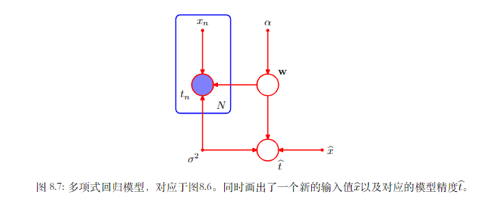
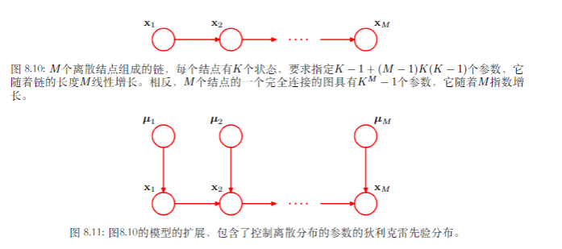

# 8 图模型
使用概率分布的图形表示被称为概率图模型，该模型提供了几个有用的性质：
* 提供了简单的概率模型可视化的简单方式，可用于设计新的模型
* 通过观察模型，可以深刻认识模型的性质，包括条件独立性质
* 高级模型的推断和学习过程中的复杂计算可以根据图计算表达，图隐式承载了背后的数学表达式。

在概率图模型中，每个结点表示一个随机变量，链接表示这些变量之间的概率关系，图描述了联合概率分布在所有随机变量上能够分解为一组因子的乘积的方式，每个因子只依赖于随机变量的一个子集。
* 贝叶斯网络，也叫有向图模型，图之间的连接有特定的方向，使用箭头表示。
* 马尔科夫随机场，也叫无向图模型，连接没有箭头，没有方向性质

有向图对于表达随机变量之间的因果关系是很有用的，而无向图对于表示随机变量之间的软限制比较有用。为了求解推断问题，较方便的方法是将有向图和无向图都转化为不同的表示形式，被称为因子图。

## 8.1 贝叶斯网络
首先对于三个变量$a,b,c$上的任意的一个联合分布$p(a,b,c)$。他们可以是离散或连续的，图模型的强大之处在于一个具体的图可以表示一大类的概率分布，可以写成下面的形式：
$$p(a,b,c)=p(c|a,b)p(a,b)=p(c|a,b)p(b|a)p(a)$$

可以表示为下图

如果存在一个从结点a到结点b的链接，那么我们说结点a是结点b的父节点，节点b是a的子节点。
我们可以将其拓展到K个变量的联合概率分布$p(x_1,\dotsb,x_K)$,可以表示为：
$$p(x_1,\dotsb,x_K)=p(x_K|x_1,\dotsb,x_{K+1})\dotsb p(x_2|x_1)p(x_1)$$

对于一个给定的K，我们可以将其表示为K个节点的有向图，每一个节点对英语公式右侧的一个条件概率分布，每一个节点的输入链接包括所有以编号低于当前节点编号为起点的链接，我们说这个图是全连接的，因为每对节点之间都存在一个链接。
而真正传递出图表示的概率分布的性质的信息是图中链接的缺失。
我们对于图8.2写出其对应的联合概率密度表达式：

$$p(x_1)p(x_2)p(x_3)p(x_4|x_1,x_2,x_3)p(x_5|x_1,x_3)p(x_6|x_4)p(x_7|x_4,x_5)$$
所以在给定的有向图和变量上对应的一般关系：
在图的所有节点上定义的联合概率分布由一系列的条件概率的乘积组成，每一项对应图中的一个节点。每一个这样的条件概率分布的条件都是图中对应节点的父节点所对应的变量。因此对于有K个节点的图，联合概率为：
$$p(x)=\prod_{k=1}^K p(x_k|\mathbf{pa_k})$$

其中$\mathbf{pa_K}$表示节点$x_k$的父节点的集合，$x=\{x_1,\dotsb,x_K\}$。
这个关键的方程表示有向图模型的联合概率分布的分解属性，我们可以很容易地推广到让图的每一个节点关联一个变量的集合，或者关联向量值的变量，如果右侧的每一个条件概率分布都是归一化的，则这个表示方法整体总是归一化的。
我们考虑的有向图要满足一个重要的限制：不能存在有向环，所以这样的图一定是有向无环图，或者**DAG**。

### 8.1.1 例子：多项式回归
对于一个贝叶斯多项式拟合模型，随机变量为多项式系数向量$w$和观测数据$\mathbf t=(t_1,\dotsb,t_N)^T$。此外，该模型包含输入数据$\mathbf x=(x_1,\dotsb,x_N)^T$,噪声方差$\sigma^2$以及表示w的高斯先验分布的精度的超参数$\alpha$,这些都是模型的参数而非随机变量，所以我们看到联合概率分布等于先验分布与N个条件概率分布的乘积：
$$p(\mathbf t|w)=p(w)\prod_{n=1}^N p(t_n|w)$$

我们在图模型中引入图结构称为板，标记为N，表示有N个同类型的点。
可以显式写出模型的参数和随机变量：
$$p(\mathbf t,w|\mathbf x,\alpha,\sigma^2)=p(w|\alpha)\prod_{n=1}^N p(t_n|w,x_n,\sigma^2)$$

我们可以在图表示中显示写出$\mathbf x,\alpha$,随机变量可以用空心圆表示，确定性参数由小的实心圆表示。
当我们使用图模型于模式识别问题当中时，我们将某些随机变量设置为具体的值，比如将变量$\{t_n\}$根据多项式曲线拟合问题中的训练集进行设置。在图模型中，通过给特定的节点加上阴影来表示观测变量。

图中的例子里，w不是观测变量，而是潜在变量的一个例子。
当观测到$\{t_n\}$的值，如果有必要的话，可以计算参数$w$的后验概率：
$$p(w|\mathbf t)\propto p(w)\prod_{n=1}^N p(t_n|w)$$

其中省略了确定性参数。
一般情况下，我们不关心$w$这样的参数，而是要对输入变量进行预测，给定一个输入值$\hat x$,我们希望得到以观测数据为条件的$\hat t$的概率分布。以确定性参数为条件，模型的所有随机变量的联合概率分布为：
$$p(\hat t,\mathbf t,w|\hat x,\mathbf x,\alpha,\sigma^2)=\Bigg[\prod_{n=1}^Np(t_n|x_n,w,\sigma^2)\Bigg]p(w|\alpha)p(\hat t|\hat x,w,\sigma^2)$$

然后根据概率的加和原则，对模型参数w进行积分，可以得到$\hat t$的预测分布：
$$p(\hat t|\hat x,\mathbf x,\mathbf t,\alpha,\sigma^2)\propto\int p(\hat t,\mathbf t,w|\hat x,\mathbf x,\alpha,\sigma^2){\rm d}w$$

其中我们隐式地将$\mathbf t$中的随机变量设置为数据集中观测到的具体值。

### 8.1.2 生成式模型
我们希望从给定的概率分布中抽取样本，使用图模型可以采用祖先采样的方式：考虑对于$K$个变量的一个联合概率分布$p(x_1,\dotsb,x_N)$,它根据公式$p(x)=\prod_{k=1}^Kp(x_k|\mathbf{pa_k})$进行分解，对应于一个有向无环图，我们假设每一个节点的序号都大于他的父节点，我们的目标是从这样的联合概率分布中采样$\hat x_1,\dotsb,\hat x_K$。
我们首先可以选出序号最小的节点，按照概率$p(x_1)$进行采样，记作$\hat x_1$,然后顺序计算每一个节点，使得对于节点n，可以根据条件概率分布$p(x_n|\mathbf {pa_k})$进行采样，其中父节点的变量被设置为他们的取样值。在每一个阶段，父节点的变量总是可以得到的。因为它们对应于已采样过的序号较小的节点。一旦我们对最后的变量$x_K$采样完毕，我们就达到了根据联合概率密度分布取样的目标。为了得到对应于变量的子集的边缘概率分布中进行取样，我们简单的对联合概率分布进行取样，简单地取要求的节点的取样值，忽略剩余节点的取样值。例如，为了对于$p(x_2,x_4)$进行取样，我们简单地对联合概率分布取样，然后保留$\hat x_2,\hat x_4$，丢弃剩余的值$\{\hat x_{j\neq \{2,4\}}\}$.
对于概率模型的实际应用，通常的情况是，数量众多的变量对应于图的终端结点（表示观测值），较少的变量对应于潜在变量。潜在变量的主要作用是使得观测变量上的复杂分布可以表示为由简单条件分布（通常是指数族分布）构建的模型。
图模型描述了生成观测数据的一种因果关系（causal）过程,因此这种模型也被称为生成式模型。之前描述的多项式回归模型不是生成式模型，因为没有与输入变量x相关联的概率分布，因此无法从该模型中人工生成数据点。通过引入合适的先验概率分布$p(x)$，我们可以将模型转变为生成式模型，代价是增加了模型复杂度。
概率模型中的隐含变量不必具有显式的物理含义。它的引入可以仅仅为了从更简单的成分中建立一个更复杂的联合概率分布。在任何一种情况下，应用于生成式模型的祖先取样方法都模拟了观测数据的创造过程，因此可以产生“幻想的”数据，它的概率分布（如果模型完美地表示现实）与观测数据的概率分布相同。在实际应用中，从一个生成式模型中产生人工生成的观测数据，对于理解模型所表示的概率分布形式很有帮助。
### 8.1.3 离散变量
如果将有向图中所有的父节点-子节点对的关系选为共轭的，那么这样的模型会有一些较好的性质，如果父节点和子节点都是对应于离散变量的，对于有K个可能状态的一元离散变量$x$,概率$p(x|\mu)=\prod_{k=1}^K \mu_k^{x_k}$,并且由参数$\mu=(\mu_1,\dotsb,\mu_K)^T$控制。由于$\sum_k\mu_k=1$,所以为了定义概率分布，只需要指定$K-1$个$\mu_k$的值即可。
如果对于两个离散变量$x_1,x_2$,每一个都有K个状态，联合概率分布为：
$$p(x_1,x_2|\mu)=\prod_{k=1}^K \prod_{l=1}^K \mu_{kl}^{x_{1k}x_{2l}}$$
由于参数$\mu_{kl}$满足限制条件$\sum_k\sum_l\mu_{kl}=1$,所以该分布由$K^2-1$个参数控制，所以对于M个变量的任意一个联合概率分布，需要确定的参数数目为$K^M-1$,因此，随M的数量指数增长。我们使用$p(x_1,x_2)=p(x_2|x_1)p(x_1)$,它对应于一个只有两个节点的图。边缘概率分布$p(x_1)$需要K-1个参数确定，类似的，对于条件概率$p(x_2|x_1)$需要对$x_1$的K个取值，分别指定K-1个参数，因此联合概率分布的参数总数值为：$(K-1)+K(K-1)=K^2-1$.
现在假设两个变量之间是独立的，这样每一个变量由一个独立的多项式概率分布描述得到，参数总数为$2(K-1)$,对于M个独立的离散变量上的概率分布，参数总数为$M(K-1)$，因此参数总数随着变量数量线性增长，所以从图的角度来看，我们通过删除节点之间的链接，减小了参数的数目，代价是类别的概率分布受到限制。
更一般的，对于M个离散变量，可以使用有向图对联合概率分布建模，每一个变量对应于一个节点，如果图是全连接的，那么得到了完全一般的概率分布，由$K^M-1$个参数，若不存在链接，则参数总数为$M(K-1)$，为了减小参数数目，可以使用参数共享的方式。

通过引入参数的狄利克雷先验，我们可以将离散变量上的图模型转化为贝叶斯模型。从图的观点来看，每个结点需要额外的父结点表示对应于每个离散结点的参数。
另一种控制离散变量模型参数数量的指数增长的方式是对条件概率分布使用参数化的模型，而不使用条件概率值的完整表格。

### 8.1.4 线性高斯模型
对于$D$个变量上的任意的有向无环图，其中结点i表示服从高斯分布的一元连续随机变量$x_i$。这个分布的均值是结点i的父结点$\mathbf{pa}_i$的状态的线性组合，即:
$$p(x_i|\mathbf{pa}_i)=\mathcal N\Bigg(x_i\Big|\sum_{j\in\mathbf {pa}_i}w_{ij}x_j+b_i,v_i\Bigg)$$
所以联合概率分布的对数是图中所有节点上的条件概率分布的乘积的对数，形式为：
$$\begin{aligned}
\ln{p(x)}&=\sum_{i=1}^D \ln{p(x_i|\mathbf{pa_i})} \\
&=-\sum_{i=1}^D \frac{1}{2v_i}\Bigg(x_I-\sum_{j\in \mathbf {pa_i}}w_{ij}x_i-b_i\Bigg)^2+\text{const}
\end{aligned}$$

所以联合概率分布是一个多元高斯分布，我们可以递归确定联合概率分布的均值和方差，每一个变量的概率分布都是高斯分布，因此：
$$x_i=\sum_{j\in \mathbf {pa_i}}w_{ij}x_j+b_i+\sqrt{v_i}\epsilon_i$$
其中$\epsilon_i$是一个零均值单位方差的高斯随机变量，满足$\mathbb E[\epsilon_i]=0,\mathbb E[\epsilon_i\epsilon_j]=I_{ij}$,对上面的式子取期望，可以得到：
$$\mathbb E[x_i]=\sum_{j\in \mathbf {pa}_i}w_{ij}\mathbb E[x_j]+b_i$$

所以从一个序号最低的节点开始，沿着图递归进行计算，就可以求出$\mathbb E[x]$的各个元素，同样地，我们可以以递归的方式得到$p(x)$的协方差矩阵的第$i,j$个元素，即：
$$\begin{aligned}
\mathbf{cov}(x_i,x_j)&=\mathbb E[(x_i-\mathbb E[x_i])]\mathbb E[(x_j-\mathbb E[x_j])] \\
&=\mathbb E\Bigg[(x_i-\mathbb E[x_i])\Big\{\sum_{j\in \mathbf{pa_j}}w_{jk}(x_k-\mathbb E[x_k])+\sqrt{v_j}\epsilon_j\Big\}\Bigg]\\
&=\sum_{k\in \mathbf{pa_j}}w_{jk}\mathbf{cov}[x_i,x_k]+I_{ij}v_j
\end{aligned}$$
因此协方差可以从序号最低的结点开始，递归地计算。
所以对于极端情况，如果图中不存在链接，在这种情况下不存在参数$w_{ij}$，只有$D$个参数$b_i$和$D$个参数$v_i$,所以根据递归关系，可以得到$p(x)$的均值为$(b_1,\dotsb,b_D)^T$,协方差矩阵为对角矩阵$\text{diag}(v_1,\dotsb,v_D)$。联合概率分布总共有$2D$个参数，表示由D个独立一元高斯分布组成的集合。
对于全连接图，由于每一个节点的序号都低于其父节点的序号。$w_{ij}$的数量为$\frac{D(D-1)}{2}$,加上协方差矩阵的参数个数，总共$\frac{D(D+1)}{2}$,对应于一个一般的对称协方差矩阵。
所以对于图8.14中的变量，使用递归关系，可以得到联合高斯分布的均值和协方差为：
$$\begin{aligned}
\mu&=(b_1,b_2+w_{21}b_1,b_3+w_{32}b_2+w_{32}w_{21}b_1)^T \\
\Sigma&=\begin{pmatrix}
v_1 &w_{21}v_1 &w_{32}w_{21}v_1\\
w_{21}v_1 &v_2+w_{21}^2v_1 &w_{32}(v_2+w_{21}^2v_1)\\
w_{32}w_{21}v_1 &w_{32}(v_2+w_{21}^2v_1) &v_3+w_{32}^2(v_2+w_{21}^2v_1)
\end{pmatrix}
\end{aligned}$$

因此节点i的条件概率分布形式为：
$$p(x_i|\mathbf{pa_i})=\mathcal N\Bigg(x_i\Bigg|\sum_{j\in \mathbf{pa_i}}W_{ij}x_j+b_i,\Sigma_i\Bigg)$$

注意，我们已经看到高斯变量x的均值$\mu$的共轭先验本身是$\mu$上的一个高斯分布。此时我们已经遇到了线性高斯关系的一个具体的例子。因此x和$\mu$的联合分布就是高斯分布。这对应于一个简单的具有两个结点的图，其中表示$\mu$和结点是表示x的结点的父结点。$\mu$上的概率分布的均值是控制先验分布的参数，因此它可以被看做超参数。由于超参数的值本身是未知的，因此我们可以再一次使用贝叶斯的观点，引入一个超参数上的先验概率分布。这个先验概率分布有时被称为超先验（hyperprior），它还是一个高斯分布。这种构造过程原则上可以延伸到任意层次。这个模型是层次贝叶斯模型（hierarchical Bayesian model）的一个例子.
## 8.2 条件独立
多变量概率分布的一个重要的概念就是条件独立，考虑变量$a,b,c$，并且假设在给定$b,c$的条件下$a$的条件概率分布不依赖于b的值，即：
$$p(a|b,c)=p(a|c)$$

则在给定c的条件下，a条件独立于b。如果考虑以c为条件下的a，b的联合分布，则：
$$\begin{aligned}
p(a,b|c)&=p(a|b,c)p(b|c) \\
&=p(a|c)p(b|c)
\end{aligned}$$

因此，我们看到了，以c为条件，a和b的联合概率分布分解为了a的边缘概率分布和b的边缘概率分布的乘积（全部以c为条件）。
如果这性质对于c的所有可能值都成立，则，可用记号：
$$a\perp\!\!\!\!\perp b|c$$
表示在给定c的条件下，a和b独立。
在使用概率模型时，条件独立性起着重要的作用：简化了模型，降低了模型的训练和推断的计算量。
如果一组变量的联合概率分布的表达式是根据条件概率分布的乘积表示的（即有向图的数学表达形式），那么原则上我们可以通过重复使用概率的加和规则和乘积规则测试是否具有潜在的条件独立性。
在实际应用中，这种方法非常耗时。图模型的一个重要的优雅的特征是，联合概率分布的条件独立性可以直接从图中读出来，不用进行任何计算。我们可以使用"d-划分"来完成该应用，其中"d"表示“有向”
### 8.2.1 图的三个例子

对于这个图的联合概率分布形式：
$$p(a,b,c)=p(a|c)p(b|c)p(c)$$

如果没有变量是观测变量，则可以对两侧进行积分或求和，考察a和b是否独立：
$$p(a,b)=\sum_c p(a|c)p(b|c)p(c)$$

一般的，不能分解为$p(a)p(b)$,所以：
$$a\not \perp\!\!\!\!\perp|\empty$$

在给定c的条件下：
$$\begin{aligned}
p(a,b|c)&=\frac{p(a,b,c)}{p(c)} \\
&=p(a|c)p(b|c)
\end{aligned}$$
所以：
$$a\perp\!\!\!\!\perp b|c$$

结点c被称为关于这个路径“尾到尾”（tail-to-tail），因为结点与两个箭头的尾部相连。
这样的一个连接结点a和结点b的路径的存在使得结点相互依赖。然而，当我们以结点c为条件时（如图8.16所示），被用作条件的结点“阻隔”了从a到b的路径，使得a和b变得（条件）独立了。

对应于图8.17的联合概率分布：
$$p(a,b,c)=p(a)p(c|a)p(b|c)$$

首先，如果所有变量都不是观测变量，对c积分或求和：
$$p(a,b)=p(a)\sum_{c}p(c|a)p(b|c)=p(a)p(b|a)$$

这不能分解为$p(a)p(b)$，所以：
$$a \not \perp\!\!\! \perp b|\empty$$

如果以c为条件，使用贝叶斯定理：
$$\begin{aligned}
p(a,b|c)&=\frac{p(a,b,c)}{p(c)} \\
&=\frac{p(a)p(c|a)p(b|c)}{p(c)}\\
&=p(a|c)p(b|c)
\end{aligned}$$
所以：
$$a\perp\!\!\!\perp b|c$$
与之前一样，我们可以用图表示这个结果。结点c被称为关于从结点a到结点b的路径“头到尾”（head-to-tail）。这样的一个路径连接了结点a和结点b，并且使它们互相之间存在依赖关系。如果我们现在观测结点c，如图8.18所示，那么这个观测“阻隔”了从a到b的路径，因此我们得到了条件独立性质$a\perp\!\!\!\perp b | c$。

对于8.19可以得到联合概率分布：
$$p(a,b,c)=p(a)p(b)p(c|a,b)$$
当考虑没有变量是观测变量时，我们有：
$$p(a,b)=p(a)p(b)$$
所以
$$a\perp\!\!\!\perp b|\empty$$

当以c为条件时，可以得到：
$$\begin{aligned}
p(a,b|c)&=\frac{p(a,b,c)}{p(c)} \\
&=\frac{p(a)p(b)p(c|a,b)}{p(c)}
\end{aligned}$$
这通常不能被分解为乘积$p(a|c)p(b|c)$,所以：
$$a\not \perp\!\!\!\perp b|c$$

图 形 上， 我 们 说 结 点c关 于 从a到b的 路径 是“头 到 头”（head-to-head）， 因 为 它 连 接 了 两 个 箭 头 的 头。 当 结 点c没 有 被 观 测 到 的 时候，它“阻隔”了路径，从而变量a和b是独立的。然而，以c为条件时，路径被“解除阻隔”，使得a和b相互依赖了。
我们引入一些新的概念。如果存在从结点x到结点y的一条路径，其中路径的每一步都沿着箭头的方向，那么我们说结点y是结点x的后继（descendant）。这样，可以证明，在一个头到头的路径中，如果任意结点或者它的任意一个后继被观测到，那么路径会被“解除阻隔”。
总之，一个尾到尾结点或者头到尾结点使得一条路径没有阻隔，除非它被观测到，之后它就阻隔了路径。相反，一个头到头结点如果没有被观测到，那么它阻隔了路径，但是一旦这个结点或者至少一个后继被观测到，那么路径就被“解除阻隔”了。
### 8.2.2 d-划分
考虑一个一般的有向图，其中A, B, C是任意无交集的结点集合（它们的并集可能比图中结点的完整集合要小）。
为了知道一个有向无环图是否暗含了一个特定的条件依赖$A\perp\!\!\!\perp B|C$,我们考虑从A中任意结点到B中任意结点的所有可能的路径。我们说这样的路径被“阻隔”，如果它包含一个结点满足下面两个性质中的任何一个。
* 路径上的箭头以头到尾或者尾到尾的方式交汇于这个结点，且这个结点在集合C中。
* 箭头以头到头的方式交汇于这个结点，且这个结点和它的所有后继都不在集合C中。

如果所有的路径都被“阻隔”，那么我们说C把A从B中d-划分开，且图中所有变量上的联合概率分布将会满足$A\perp\!\!\!\perp B | C$。
我们已经看到一个特定的有向图表示将联合概率分布分解为条件概率分布乘积形式的一个具体的分解方式。图也表示一组条件独立的性质，这些性质通过d-划分的方式得到，并且d-划分定理实际上是一个等价于这两个性质的表示。为了让这一点更明显，将有向图想象成滤波器是很有帮助的。
假设我们考虑x上的一个特定的联合概率分布p(x)，其中x对应于图中的（未观测）结点。一个概率分布能够通过滤波器当且仅当它能够用与图对应的公式（8.5）给出的分解方式进行分解。如果我们将变量x的集合上的所有可能的概率分布p(x)输入到滤波器中，那么通过滤波器的概率分布的子集被记作$\mathcal{DF}$，表示有向分解.
我们还可以将图用作另一种滤波器，首先将d-划分准则应用到图中，列出所有得到的条件独立性质，然后只有当一个概率分布满足所有这些性质时才允许通过。如果我们将所有可能的概率分布输入到这一类滤波器中，那么d-划分定理告诉我们，允许通过的概率分布的集合就是$\mathcal{DF}$。
一种极限的情况下，我们有一个全连接的图，它不表示任何的条件独立性质，可以表示给定变量上的任何可能的联合概率分布。集合$\mathcal{DF}$将包含所有可能的概率分布p(x)。在另一种情况下，我们有一个完全非连接的图，即一张不存在任何链接的图。这对应的联合概率分布可以分解为图结点组成的变量上的边缘概率分布的乘积。

对于任意给定的图，分布的集合DF中的概率分布还会具有图中未描述的独立性质。例如，一个完全分解的概率分布总会通过由对应变量组成的任意图结构表示的滤波器。

对于马尔科夫随机毯：对于一个联合概率分布$p(x_1,\dotsb,x_D)$,它由一个D节点的有向图表示，使用分解性质，可以得到：
$$\begin{aligned}
p(x_i|x_{\{j\neq i\}})&=\frac{p(x_1,\dotsb,x_D)}{\int p(x_1,\dotsb,x_D){\rm d}x_i} \\
&=\frac{\prod_{k}p(x_k|\mathbf{pa}_k)}{\int \prod_{k}p(x_k|\mathbf{pa}_k){\rm d}x_i}
\end{aligned}$$

我们现在观察到任何与$x_i$没有函数依赖
关 系 的 因 子 都 可 以 提 到$x_i$的 积 分 外 面， 从 而 在 分 子 和 分 母 之 间 消 去。 
唯一剩余的因子是节点$x_i$本身的条件概率分布$p(x_i|\mathbf{pa}_i)$,以及满足下面性质的节点$x_k$的条件概率分布： 结点$x_i$在$p(x_k | pa_k)$的条件集合中，即$x_i$是$x_k$的父结点。条件概率分布$p(x_i | pa_i)$依赖于结点$x_i$的父结点，而条件概率分布$p(x_k | pa_k)$依赖于$x_i$的子结点以及同父结点（co-parents），即那些对应于$x_k$（而不是$x_i$）的父结点的变量。由父结点、子结点、同父结点组成的结点集合被称为马尔科夫毯，如图8.26所示。我们可以将结点$x_i$的马尔科夫毯想象成将$x_i$与图的剩余部分隔离开的最小结点集合。注意，只包含$x_i$的父结点和子结点是不够的，因为之前的例子表明，子结点的观测不会阻隔某个结点到同父结点的路径。因此我们必须也观测同父结点。

## 8.3 马尔科夫随机场
