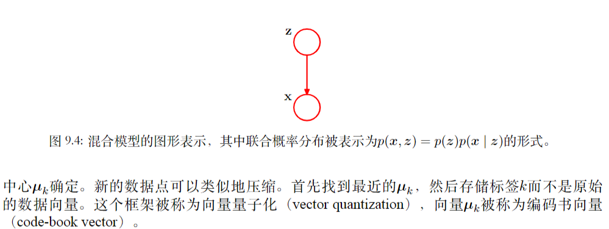
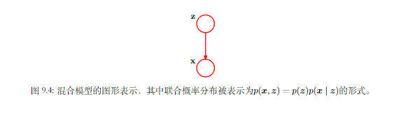
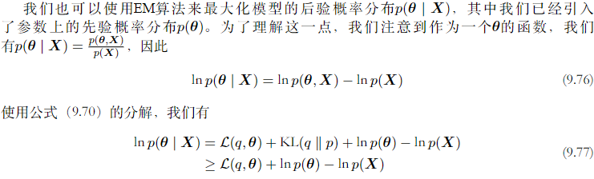

[TOC]
# 9 混合模型与EM算法
我们定义观测变量和潜在变量的一个联合概率分布，则对应的观测变量本身的概率分布可以通过求边缘概率分布的方法得到。所以观测变量上的复杂边缘概率分布可以通过观测变量与潜在变量组成的拓展空间上的更加便于计算的联合概率分布表示。
混合模型也可以用于数据聚类，而聚类问题可以使用非概率的方法得到。该方法被称为K均值算法。
## 9.1 K均值算法
首先考虑多维空间中的数据点的分组或者聚类问题。对于一个数据集$\{x_1,\dotsb,x_N\}$,它是由D维欧几里德空间中随机变量$x$的N次观测组成的，我们需要将其分为K类，假定K是已经给定的，我们可以直观的认为一组数据点构成的一个聚类中的数据点，聚类内部点的距离应该小于数据点与外部数据点之间的距离。我们引入一组D维向量$\mu_k$，其中$k=1,2,\dotsb,K$,并且$\mu_k$是与第K个聚类相关的一个代表，可以认为$\mu_k$是聚类的中心，我们想要找到每一个数据点所属的聚类，并且找到一组向量$\{\mu_k\}$,使得每个数据点与相应的$\mu_k$之间的距离的平方和最小。
所以可以使用一组对应的二值指示变量$r_{nk}\in\{0,1\}$，其中k表示的是数据点$x_n$属于K个聚类当中的那一个。如果数据点$x_n$被分配到类别k，则$r_{nk}=1$，对于$j\neq k，r_{nj}=0$.而目标函数的形式为：$$J=\sum_{n=1}^N \sum_{k=1}^K r_{nk}||x_n-\mu_k||^2$$

我们的优化目标是找到$r_{nk}$和$\mu_k$的值，使得$J$的值能够被最小化。可以使用迭代的方式得到：
* 首先，为$\mu_k$选择一些初始值，然后关于$r_{nk}$最小化$J$，保持$\mu_k$固定。
* 然后关于$\mu_k$最小化$J$，这个过程中固定$r_{nk}$
* 不断重复以上两个过程，直到优化收敛

其中更新更新$r_{nk}$和$\mu_k$的过程分别对应于EM算法当中的E过程和M过程。
首先，对于确定$r_{nk}$，由于对于$r_{nk}$来说，$J$是一个线性函数，所以优化过程可以对每一个n进行最优化，只要k的值使得$||x_n-\mu_k||^2$最小，就令$r_{nk}=1$,所以可以简单地将数据点的聚类设置为最近的聚类中心，可以表示为：
$$r_{nk}=\begin{cases}
 1 &若 k=\argmin_j ||x_n-\mu_j||^2\\
 0 &\text{otherwise}
\end{cases}$$

然后对于$\mu_k$的优化：因为J关于$\mu_k$是一个二次函数，可以令J关于$\mu_k$的导数等于0得到：
$$2\sum_{n=1}^N r_{nk}(x_n-\mu_k)=0$$

可以得到结果为：
$$\mu_k=\frac{\sum_n r_{nk}x_n}{\sum_{n}r_{nk}}$$

所以$\mu_k$的结果等于类别k中所有数据点的均值。

由于重新为数据点分配聚类的步骤以及重新计算聚类均值的步骤重复进行，直到聚类的分配不改
变（或者直到迭代次数超过了某个最大值）。由于每个阶段都减小了目标函数J的值，因此算
法的收敛性得到了保证。然而，算法可能收敛到J的一个局部最小值而不是全局最小值。
此时我们使用的是批处理版本，每次更新代表向量时都使用了整个数据集，此外在线随机算法：将Robbins-Monro步骤应用于寻找回归函数根的问题，其中的回归函数是J关于$\mu_k$的导数，所以可以使用顺序更新的方式：
$$\mu_k^{\text{new} }=\mu_k^{\text{old}}+\eta_n(x_n-\mu_k^{\text{old}})$$

K均值算法的基础是将平方欧几里得距离作为数据点与代表向量之间不相似程度的度量。这不仅限制了能够处理的数据变量的类型,而且使得聚类中心的确定对于异常点不具有鲁棒性。我们可以这样推广K均值算法：引入两个向量x和x′之间的一个更加一般的不相似程度的度量$\mathcal{V}(x,x')$,然后最小化失真度量：
$$\tilde{J}=\sum_{n=1}^N\sum_{k=1}^Kr_{nk}\mathcal{V}(x_n,\mu_k)$$

这就给出了K中心点算法.与之前一样，对于给定的聚类代表$\mu_k$，E步骤涉及到为每个数据点分配聚类，使得与对应的聚类代表的不相似程度最小。这一步的计算代价为$O(KN )$，与标准的K均值算法的情形相同。对于不相似程度度量的一般选择，M步骤通常比K均值的情形更加复杂，因此通常会将聚类原型限制为等于某个分配到那个聚类的数据向量，因为这使得算法可以适用于任何不相似程度的度量$\mathcal V(.,.)$，只要它能够被计算。因此，对于每个聚类k，M步骤涉及到在分配到那个聚类的$N_k$个点上的离散搜索，这需要$O(N ^2_k )$次对$\mathcal V(.,.)$的计算
### 9.1.1 图像分割与压缩

## 9.2 混合高斯
高斯混合概率分布可以写成高斯分布的线性叠加形式：
$$p(x)=\sum_{k=1}^K \pi_k\mathcal N(x|\mu_k,\Sigma_k)$$

我们可以引入一个K维的二值随机变量z，$z_k$满足限制：
$$z_k\in\{0,1\}, \sum_k z_k=1$$

我 们 根 据 边 缘 概 率 分 布p(z)和 条 件 概 率 分布$p(x | z)$定义联合概率分布$p(x, z)$,对应于图模型9.4：

$z$的边缘概率分布根据混合系数$\pi_k$进行赋值，可以得到：
$$p(z_k=1)=\pi_K$$

参数满足：
$$0\leq \pi_k\leq 1,\sum_k\pi_k=1$$

所以也可以表示为：
$$p(z)=\prod_{k=1}^K \pi_k^{z_k}$$

所以给定z的值时，可以得到x的条件概率分布形式为高斯分布：
$$p(x|z_k=1)\mathcal N(x|\mu_k,\Sigma_k)=\prod_{k=1}^K \mathcal N(x|\mu_k,\Sigma_k)^{z_k}$$

x的边缘概率分布为：
$$p(x)=\sum_z p(z)p(x|z)=\sum_{k=1}^K \pi_k\mathcal N(x|\mu_k,\Sigma_k)$$

所以对于每一个观测数据点$x_n$,都有对应的潜在变量$z_n$。
我们给出在给定x的条件下，z的条件概率，可以用$\gamma(z_k)$表示$p(z_k=1|x)$，使用贝叶斯定理可以得到:
$$\begin{aligned}
\gamma(z_k)=p(z_k=1|x)&=\frac{p(z_k=1)p(x|z_k=1)}{\sum_{j=1}^K p(z_j=1)p(x|z_j=1)} \\
&=\frac{\pi_k\mathcal N(x|\mu_k,\Sigma_k)}{\sum_{j=1}^K \pi_j\mathcal N(x|\mu_j,\Sigma_j)}
\end{aligned}$$

可以将$\pi_k$表示为$z_k=1$的先验概率，将$\gamma(z_k)$表示为观测到x之后，对应的后验概率，也可以被看做分量k对于“解释”观测值x的“责任”。
可以使用祖先取样的方式生成服从高斯混合模型的概率分布的随机样本。可以先生成z的一个值，记作$\hat z$,服从概率分布$p(z)$。然后使用条件概率分布$p(z|\hat z)$生成x的值。
### 9.2.1 最大似然
对于观测数据集$\{x_1,\dotsb,x_N\}$,我们将数据集表示为$N\times D$的矩阵$X$,其中的第$n$行是$x_n^T$,对应的隐变量可以表示为$N\times K$的矩阵$Z$，它的第$n$行为$z_n^T$,我们假定数据点独立的从概率分布中抽取，可以用9.6的图模型表示独立同分布数据集的高斯混合模型。

对数似然函数为：
$$\ln{p(X|\pi,\mu,\Sigma)}=\sum_{n=1}^N \ln\Bigg\{\sum_{k=1}^K \pi_k\mathcal N (x_n|\mu_k,\Sigma_k)\Bigg\}$$

我们可以考虑一个简化形式，对于高斯混合模型，分量的协方差矩阵为$\Sigma_k=\sigma_k^2I$.假设混合模型的第j个分量的均值$\mu_j$与某个数据点完全相同，则该数据点会为似然函数贡献一项：
$$\mathcal N(x_n|x_n,\Sigma^2_jI)=\frac{1}{(2\pi)^{\frac{1}{2}}}\frac{1}{\sigma_j^D}$$
考虑极限$\sigma_j\rightarrow 0$,这一项就趋于无穷大，所以会出现奇异性问题，会发生在任何一个退化到具体数据点上的高斯分量上。我们可以通过一些启发式的方法来避免奇异性，例如如果检测到高斯分量收缩到一个点，则将其均值重新设定为一个随机选择的值，并重新设置方差为一个较大的值。
### 9.2.2 用于高斯混合模型的EM
寻找带有潜在变量模型的最大似然解的方法就是期望最大化算法，或者是EM算法。
我们使得似然函数关于高斯分量均值$\mu_k$导数为0：
$$\sum_{n=1}^K \frac{\pi_k \mathcal N(x_n|\mu_k,\Sigma_k)}{{\sum_j \pi_j\mathcal N(x_n,|\mu_j,\Sigma_j)}}\Sigma_k^{-1}(x_n-\mu_k)=0$$

其中$\sum_j \pi_j\mathcal N(x_n,|\mu_j,\Sigma_j)=\gamma(z_{nk})$

两侧同时乘以$\Sigma_k$,可以得到：
$$\mu_k=\frac{1}{N_k}\sum_{n=1}^N \sum_{n=1}^N \gamma(z_{nk})x_n$$

其中定义了：
$$N_k=\sum_{n=1}^N \gamma(z_{nk})$$

我们可以将$N_k$看做分配到聚类k的数据点的有效数量。
同样的，可以对$\Sigma_k$得到相似的结果：
$$\Sigma_k=\frac{1}{N_k}\sum_{n=1}^N \gamma(z_{nk})(x_n-\mu_k)(x-\mu_k)^T$$

这与一元高斯分布的对应的结果具有相同的函数形式，但是与之前一样，每个数据点都有一个权值，权值等于对应的后验概率，分母为与对应分量相关联的数据点的有效数量。
对于$\pi_k$，考虑限制$\sum_{k=1}^K \pi_k=1$，使用拉格朗日乘数法，最大化下面的：
$$\ln{p(X|\pi,\mu,\Sigma)}+\lambda \Bigg(\sum_{k=1}^K \pi_k-1\Bigg)$$

可以得到：
$$\sum_{n=1}^N \frac{\mathcal N(x_n|\mu_k,\Sigma_k)}{\sum_{j}\pi_j\mathcal{N}(x_n|\mu_j,\Sigma_k)}+\lambda=0$$

可以得到$\lambda=-N,\pi_k=\frac{N_k}{N}$

与`k-means`算法相比，`EM`算法在达到收敛之前，经历的迭代次数更多，每次迭代的计算量更大，所以可以使用k-means算法先找到一个较好的初始值， 然后使用EM算法进行调节。协方差矩阵可以很方便地初始化为通过K均值算法找到的聚类的样本协方差，混合系数可以被设置为分配到对应类别中的数据点所占的比例。
对于高斯混合模型，关于参数最大化似然函数的EM算法为：

----
* 初始化均值$\mu_k$,协方差$\Sigma_k$和混合系数$\pi_k$,计算对数似然函数的初始值
* $\mathbf E$步骤：使用当前参数值计算责任：$$\gamma(z_{nk})=\frac{\pi_k\mathcal N(x_n|\mu_k,\Sigma_k)}{\sum_{j=1}^K\pi_j\mathcal N(x_n|\mu_j,\Sigma_j)}$$
* $\mathbf M$步骤：使用当前责任重新估计参数：$$\begin{aligned}
\mu_k^{\text{new}}&=\frac{1}{N_k}\sum_{n=1}^N \gamma(z_{nk})x_n \\
\Sigma_k^{\text{new}}&=\frac{1}{N_k}\sum_{n=1}^N \gamma(z_{nk})(x_n-\mu_k^{\text{old}})(x_n-\mu_k^{\text{old}})^T\\
\pi_k^{\text{new}}&=\frac{N_k}{N}\\
N_k&=\sum_{n=1}^N \gamma(z_{nk})
\end{aligned}$$
* 计算对数似然函数$$\ln{p(X|\mu,\Sigma,\pi)}=\sum_{n=1}^N \ln\Bigg\{\sum_{k=1}^K \pi_k \mathcal N(x_n|\mu_k,\Sigma_k)\Bigg\}$$

检查参数或者对数似然函数的收敛性，如果没有满足收敛准则，则返回第二步。

---

## 9.3 EM的另一种观点
EM算法的目标是找到有潜在变量的模型的最大似然解，对数似然函数为：
$$\ln{p(X|\theta)}=\ln\Bigg\{\sum_Z p(X,Z|\theta)\Bigg\}$$

对于潜在变量的求和位于对数内部。 即使联合概率分布$p(X,Z|\theta)$属于指数族分布，由于求和式的存在，边缘概率分布$p(X|\theta)$通常不是指数族分布。求和式的出现组织了对数运算直接作用于联合概率分布，使得最大似然解的形式更加复杂。
对于X中的每一个观测，都有潜在变量Z的对应值，可以将$\{X,Z\}$称为完整数据集，并且实际的观测数据集$\{X\}$是不完整的，我们假设对于完整数据集的对数似然函数进行最大化是容易的。
然而实际应用中，对于Z的知识来源仅仅来自于后验概率分布$p(Z|X,\theta)$.由于不能使用完整数据的对数似然函数，所以我们考虑在潜在变量的后验概率分布下，他的期望值。这就对应于EM算法的E步骤。在接下来M步骤中，最大化这个期望。当前对于参数的估计为$\theta^{\text{old}}$,经过一次连续的E步骤和M步骤就会产生一个修正的估计$\theta^{\text{new}}$。算法在初始化的时候选择参数$\theta_0$的某个起始值.
在E步骤中我们使用当前的参数值找到潜在变量的后验概率分布$p(Z|X,\theta^{\text{old}})$,然后使用该后验概率分布计算完整数据对数似然函数对于一般参数$\theta$的期望值，这个期望值记作$Q(\theta,\theta^{\text{old}})$:
$$Q(\theta,\theta^{\text{old}})=\sum_{Z}p(Z|X,\theta^{\text{old}})\ln{p(X,Z|\theta)}$$

在M步骤中，可以通过最大化下式：
$$\theta^{\text{new}}=\argmax_{\theta}Q(\theta,\theta^{\text{old}})$$

获得修正后的参数估计$\theta^{\text{new}}$。由于对数操作时直接作用于联合概率分布的，所以M步骤的最大化是可以计算的。
所以给定观测变量X和潜在变量Z的联合概率分布$p(X,Z|\theta)$，由参数$\theta$控制，目标是关于$\theta$最大化似然函数$p(X|\theta)$.

---
* 选择参数$\theta^{\text{old}}$的一个初始设置
* E步骤：计算$p(Z|X,\theta^{\text{old}})$
* M步骤：计算$\theta^{\text{new}}$:$$\theta^{\text{new}}=\argmax_{\theta}Q(\theta,\theta^{\text{old}})$$
其中$$Q(\theta,\theta^{\text{old}})=\sum_{Z}p(Z|X,\theta^{\text{old}})\ln{p(X,Z|\theta)}$$

* 检查对数似然函数或是参数值的收敛性，若不满足收敛准则，那么令：$$\theta^{\text{old}}\leftarrow \theta^{\text{new}}$$
  然后回到第二步

---

EM算法也可以寻找模型的MAP（最大后验概率）解，我们定义一个参数上的先验概率分布$p(\theta)$.此时E步骤与最大似然的情形相同，在M步骤中，需要最大化的量是$Q(\theta,\theta^{\text{old}})+\ln{p(\theta)}$.选择合适的先验可以消除先前提到的奇异性。
这里考虑的是使用EM算法最大化一个包含离散潜在变量的似然函数，也适用于未观测的变量对应于数据集的缺失值的情形。观测值的概率分布可以通过对于所有的变量的联合概率分布关于缺失变量求和或者积分的方式得到，EM算法就可以用于最大化对应的似然函数。

### 9.3.1 重新考察高斯混合模型
似然函数的形式为：$$p(X,Z|\mu,\Sigma.\pi)=\prod_{n=1}^N \prod_{k=1}^K \pi_k^{z_{nk}}\mathcal N(x_n|\mu_k,\Sigma^k)^{z_{nk}}$$

其中$z_{nk}$表示$z_n$的第k个分量，取对数可以得到：
$$\ln{p(X,Z|\mu,\Sigma,\pi)}=\prod_{n=1}^N \prod_{k=1}^Kz_{nk}\{\ln \pi_k +\ln \mathcal N(x_n|\mu_k,\Sigma_k)\}$$

我们看到在k上的求和与对数运算的顺序交换了。对数运算现在直接作用于高斯分布上，而高斯分布本身是指数族分布的一个成员。丝毫不令人惊讶，这种方法产生了最大似然问题的一个简单得多的解.
关于均值或协方差的最大化与单一高斯分布的情形完全相同，唯一的区别是它只涉及到被“分配”到那个分量的数据点的子集.
对于混合系数的最大化问题，由于加和限制，不同k值的混合系数相互关联，可以使用拉格朗日乘数法进行优化，结果为：
$$\pi_k=\frac{1}{N}\sum_{n=1}^N z_{nk}$$

所以混合系数等于分配到对应分量的数据点所占的比例。
与之前的讨论一样，我们考虑完整数据对数似然函数关于潜在变量后验概率分布的期望，使用贝叶斯定理，可以得到后验概率分布的形式为：
$$p(Z|X,\mu,\Sigma,\pi)\propto \prod_{n=1}^N \prod_{k=1}^K \Big[\pi_k \mathcal N(x_n|\mu_k,\Sigma_k)\Big]^{z_{nk}}$$

$\{z_n\}$是独立的，所以在后验概率分布下，指示值$z_{nk}$的期望是：
$$\begin{aligned}
\mathbb E[z_{nk}]&=\frac{\sum_{z_n} z_{nk}\prod_{k'}[\pi_{k'}\mathcal N(x_n|\mu_{k'},\Sigma_{k'})]^{z_{nk}}}{\sum_{z_n}\prod_{j} [\pi_j\mathcal N(x_n,\mu_j,\Sigma_j)]^{z_{nj}}} \\
&=\frac{\pi_k\mathcal N(x_n|\mu_k,\Sigma_k)}{\sum_{j=1}^K \pi_j \mathcal N(x_n|\mu_j,\Sigma_j)}\\
&=\gamma(z_{nk})
\end{aligned}$$

完整数据的对数似然函数的期望值为
$$\mathbb E_Z[\ln{p(X,Z|\mu,\Sigma,\pi)}]=\sum_{n=1}^N \sum_{k=1}^K \gamma(z_{nk})\{\ln{\pi_k}+\ln{\mathcal N(x_n|\mu_k,\Sigma_k)}\}$$

所以可以首先为参数$\mu^{\text{old}},\Sigma^{\text{old}},\pi^{\text{old}}$选择某个初始值，使用初始值计算责任，然后保持责任固定，最大化其他参数。
### 9.3.2 与K均值的关系
k-means算法是对数据点的聚类进行了硬分配，每个数据点只属于唯一的聚类，EM算法则基于后验概率分布，进行了一个软分配，所以k-means算法可以看作是高斯混合模型的EM算法的一个特殊极限情况。
对于高斯混合模型，混合分量的协方差矩阵为$\epsilon I$,$\epsilon$是一个被所有分量共享的方差参数：
$$p(x|\mu_k,\Sigma_k)=\frac{1}{(2\pi\epsilon)^{\frac{D}{2}}}\exp\Big\{-\frac{1}{2}||x-\mu_k||^2\Big\}$$

我们将$\epsilon$看作是一个固定的常数，而非需要重估计的参数，对于特定的数据点$x_n$，后验概率为：
$$\gamma(z_{nk})=\frac{\pi \exp\Big(-\frac{||x_n-\mu_k||^2}{2\epsilon}\Big)}{\sum_j \pi_j \exp\Big(-\frac{||x_n-\mu_j||^2}{2\epsilon}\Big)}$$

对于极限情况$\epsilon\rightarrow 0$,对于数据点$x_n$,只有项j的责任$\gamma(z_{nj})$趋近于1，其他项的责任趋近于0.所以得到了一个对于数据点聚类的硬分配，$\gamma(z_{nk})\rightarrow r_{nk}$,所以每一个数据点都被分配为距离最近的均值的聚类。
最后，在极限$\epsilon\rightarrow 0$的情况下，对数似然函数为：
$$\mathbb E_Z[\ln{p(X,Z|\mu,\Sigma,\pi)}]\rightarrow -\frac{1}{2}\sum_{n=1}^N \sum_{k=1}^K r_{nk}||x_n-\mu_k||^2+\text{const}$$

最大化完整数据对数似然函数期望等价于k-means的失真度量J。
### 9.3.3 伯努利分布的混合
考虑对于D个二值变量$x_i$组成的集合，每一个变量有一个参数$\mu_i$的伯努利分布控制：
$$p(x|\mu)=\prod_{i=1}^D \mu_i^{x_i}(1-\mu_i)^{1-x_i}$$

可以得到：
$$\begin{aligned}
\mathbb E[x] &=\mu\\
\mathbf{cov}[x] &=\mathbf{diag}\{\mu_j(1-\mu_j)\}
\end{aligned}$$

现在考虑该分布的有限混合：
$$p(x|\mu,\pi)=\sum_{k=1}^K \pi_k p(x|\mu_k)$$

其中$\mu=\{\mu_1,\dotsb,\mu_K\},\pi=\{\pi_1,\pi_K\}$,并且：
$$p(x|\mu_k)=\prod_{i=1}^D \mu_{ki}^(x_i)(1-\mu_{ki})^{(1-x_i)}$$
混合分布的均值和方差为：
$$\begin{aligned}
\mathbb E[x]&=\sum_{k=1}^K \pi_k p(x|\mu_k) \\
\mathbf{cov}[x]&=\sum_{k=1}^K \pi_k \{\Sigma_k+\mu_k\mu_k^T\}-\mathbb{E}[x]\mathbb{E}[x]^T
\end{aligned}$$

其中$\Sigma_k=\mathbf{diag}\{\mu_{ki}(1-\mu_{ki})\}$,对于数据集$X=\{x_1,\dotsb,x_N\}$，对数似然函数为：
$$\ln{p(X|\mu,\pi)}=\sum_{n=1}^N \ln\Bigg\{\sum_{k=1}^K\pi_kp(x_n|\mu_k)\Bigg\}$$

我们看到求和运算位于对数运算内部，从而最大似然解没有解析解。
x的条件概率分布为$$p(x|z,\mu)=\prod_{k=1}^K p(x|\mu_k)^{z_k}$$

潜在变量的先验为：
$$p(z|\pi)=\prod_{k=1}^K \pi_k^{z_k}$$
完整数据的对数似然函数为：
$$\ln{p(X,Z|\mu,\pi)}=\sum_{n=1}^N \sum_{k=1}^K z_{nk}\Bigg\{\ln{\pi_k}+\sum_{i=1}^D \Big[x_{ni}\ln{\mu_{ki}}+(1-x_{ni})\ln(1-\mu_{ki})\Big]\Bigg\}$$

完整数据对数似然函数关于潜在变量后验概率分布的期望，得:
$$\mathbb E_Z[\ln{p(X,Z|\mu,\pi)}]=\sum_{n=1}^N \sum_{k=1}^K \gamma(z_{nk})\Bigg\{\ln{\pi_k}+\sum_{i=1}^D \Big[x_{ni}\ln{\mu_{ki}}+(1-x_{ni})\ln(1-\mu_{ki})\Big]\Bigg\}$$

在E步骤中，后验概率使用贝叶斯定理，计算得到：
$$\begin{aligned}
\gamma(z_{nk})=\mathbb E[z_{nk}] &=\frac{\sum_{z_n}z_{nk}\prod_{k'}[\pi_{k'}p(x_n|\mu_{k'})]^{z_{nk'}}}{\sum_{z_n}\prod_{j}[\pi_jp(x_n|\mu_j)]^{z_{nj}}}\\
&=\frac{\pi_kp(x_n|\mu_k)}{\sum_{j=1}^K \pi_jp(x_n|\mu_j)}
\end{aligned}$$

对于$\mathbb E_Z[\ln{p(X,Z|\mu,\pi)}]$，对n求和，可以得到，责任只出现在两项当中，即：
$$\begin{aligned}
N_k&=\sum_{n=1}^N \gamma(z_{nk}) \\
\bar x_k&=\frac{1}{N_k}\sum_{n=1}^N \gamma(z_{nk})x_n
\end{aligned}$$

我们在M步中关于参数$\mu_k$和$\pi$最大化完整数据对数似然函数的期望，我们令$\mathbb E_Z[\ln{p(X,Z|\mu,\pi)}]$关于$\mu_k$的导数为0，可以得到：
$$\mu_k=\bar x_k$$

分量k的均值组成的集合等于数据的加权平均值，权系数为分量k对于数据点的“责任”。
对于关于$\pi_k$的最大化，我们需要引入一个拉格朗日乘数来满足限制条件$\sum_k \pi_k=1$,可以得到：
$$\pi_k=\frac{N_k}{N}$$

这与直觉相符，即分量k的混合系数等于数据集里那个分量的数据点所占的比例。
与混合高斯模型不同，不存在似然函数趋于无穷大的奇异性。我们注意到似然函数是有界的，因为$0\leq p(x_n|\mu_k)\leq 1$.确实存在似然函数趋于零的奇异性，但是只要EM在初始化时没有选择一个病态的起始点，这些点就不会被找到，因为EM算法总是增大似然函数的值，直到达到局部极大值。
### 9.3.4 贝叶斯线性回归的EM算法
对于贝叶斯线性回归问题，目标是关于$\alpha,\beta$最大化证据函数$p(\mathbf t|\alpha,\beta)$。由于参数w已经被积分出去，所以可看作是潜在变量，可以使用EM算法优化边缘似然函数。
完整数据的对数似然函数是：
$$\ln{p(\mathbf t,w|\alpha,\beta)}=\ln{p(\mathbf t|w,\beta)}+\ln{p(w|\alpha)}$$

关于w的后验概率分布取期望，可以得到：
$$\mathbb E[\ln{p(\mathbf t,w|\alpha,\beta)}]=\frac{M}{2}\ln{\frac{\alpha}{2\pi}}-\frac{\alpha}{2}\mathbb E[w^tw]+\frac{N}{2}\ln{\frac{\beta}{2\pi}}-\frac{\beta}{2}\sum_{n=1}^N \mathbb E[(t_n-w^T\phi_n)^2]$$

令它关于$\alpha$的导数等于0，可以得到：
$$\alpha=\frac{M}{\mathbb E[w^Tw]}$$

## 9.4 一般形式的EM算法

期望最大化算法，或者EM算法，是寻找具有潜在变量的概率模型的最大似然解的一种通用的方法
将所有的观测变量记为X，所有的隐含变量记为Z，联合概率分布$p(X,Z|\theta)$由参数$\theta$ 控制，目标是最大化似然函数：
$$p(X|\theta)=\sum_Zp(X,Z|\theta)$$

我们假设直接最优化$p(X |\theta)$比较困难，但是最优化完整数据似然函数$p(X, Z | \theta)$就容易得多。接下来，我们引入一个定义在潜在变量上的分布$q(Z)$。我们观察到，对于任意的$q(Z)$，下面的分解成立:

$$\begin{aligned}
\ln{p(X|\theta)}&=\mathcal L(q,\theta)+\mathbf{KL}(q||p) \\
\mathcal L(q,\theta)&=\sum_Z q(z)\ln\Bigg\{\frac{p(X,Z|\theta)}{q(Z)}\Bigg\}\\
\mathbf{KL}(q||p)&=-\sum_{Z}q(Z)\ln\Bigg\{\frac{p(Z|X,\theta)}{q(Z)}\Bigg\}
\end{aligned}$$

由于$\mathbf{KL}(q||p)\geq 0$,当且仅当$q=p$时，等号成立，所以$\mathcal L(q,\theta)\leq \ln{p(X|\theta)}$,也就是说，$\mathcal L(q,\theta)$是$\ln{p(X|\theta)}$的一个下界。
EM算法是一个两阶段的迭代优化算法，用于寻找最大似然解。在E步骤中，下界$\mathcal L(q,\theta^{\text{old}})$关于$q(Z)$被最大化，而$\theta^{\text{old}}$固定，最大化问题的解很容易看出来。我们注意到$ln p(X | \theta^{\text{old}})$不依赖于$q(Z)$，因此$L(q, \theta^{\text{old}})$的最大值出现在Kullback-Leibler散度等于零的时候，换句话说，最大值出现在$q(Z)$与后验概率分布$p(Z | X, \theta^{\text{old}})$相等的时候。此时，下界等于对数似然函数，如图9.12所示。
在接下来的M步骤中，分布$q(Z)$保持固定，下界$\mathcal L(q,\theta)$关于$\theta$最大化，得到某个新值$\theta^{\text{new}}$,这会使得下界增大，所以对数似然函数也会增大，此时由于q是旧参数值确定的，在M步骤中并未发生改变，所以不会等于新的后验概率分布$p(Z|X,\theta^{\text{new}})$,所以此时KL散度不为零，所以对数似然函数的增量大于下界的增量。

EM算法的计算也可以被看做参数空间中的运算。这里，红色曲线表示（不完整数据）对数似然函数，它的最大值是我们想要得到的。我们首先选择某个初始的参数值$\theta^{\text{old}}$，然后在第一个E步骤中，我们计算潜在变量上的后验概率分布，得到了$\mathcal L(q, \theta^{\text{old}})$的一个更小的下界。它的值等于在$\theta^{\text{old}}$处的对数似然函数值，用蓝色曲线表示。注意，下界与对数似然函数在$\theta^{\text{old}}$处以切线的方式连接，因此两条曲线的梯度相同。这个界是一个凹函数，对于指数族分布的混合分布来说，有唯一的最大值。在M步骤中，下界被最大化，得到了新的值$\theta^{\text{new}}$，这个值给出了比$\theta^{\text{old}}$处更大的对数似然函数值。接下来的E步骤构建了一个新的下界，它在$\theta^{\text{new}}$处与对数似然函数切线连接，用绿色曲线表示。

对于独立同分布数据集的特殊情形,根据独立性假设，我们有$$p(X,Z)=\prod_n p(x_n,z_n)$$

对于$\{z_n\}$求边缘概率分布，可以得到$p(X)=\prod_np(x_n)$,后验概率分布的形式为：
$$p(Z|X,\theta)=\frac{p(X,Z|\theta)}{\sum_Zp(X,Z|\theta)}=\frac{\prod_n p(x_n,z_n|\theta)}{\sum_Z \prod_n p(x_n,z_n|\theta)}=\prod_{n=1}^N p(z_n|x_n,\theta)$$

因此后验概率分布也可以关于n进行分解。在高斯混合模型的情形中，这个结果意味着混合分布的每个分量对于一个特定的数据点$x_n$的“责任”只与$x_n$的值和混合分量的参数$\theta$有关，而与其他数据点无关。

我们已经看到，EM算法的E步骤和M步骤都增大了对数似然函数的一个良好定义的下界的值，并且完整的EM循环会使得模型的参数向着使对数似然函数增大的方向进行改变（除非已经达到了一个极大值，此时参数保持不变）。

